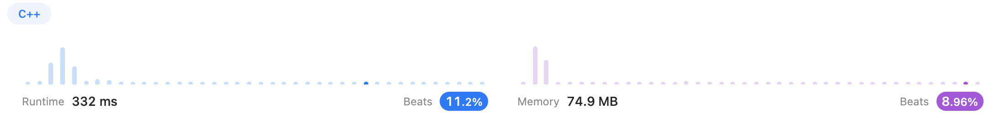

# BFS

## [1091. Shortest Path in Binary Matrix (Medium)](https://leetcode.com/problems/shortest-path-in-binary-matrix/)

### Solution 1 (✅)

[xiaoman_mandy](https://leetcode.com/xiaoman_mandy/)'s [solution](https://leetcode.com/problems/shortest-path-in-binary-matrix/solutions/312814/simple-bfs-c/).

At first, get rid of the edge conditions.

Then, use `cell` to store every start points of each iteration.

And use `directions` to try the 8 directions of each start point.

Since we use BFS, which iterates layer by layer, the first one that reaches the end point is in the shortest path.

```c++
class Solution {
public:
    int shortestPathBinaryMatrix(vector<vector<int>>& grid) {
        int N = grid.size();
        if(grid[0][0] || grid[N-1][N-1])
            return -1;
        if(N == 1)
            return 1;

        queue<pair<int,int>> cells;
        cells.push(make_pair(0,0));
        vector<vector<int>> directions = {{0, 1}, {1, 1}, {1, 0}, {1, -1}, {0, -1}, {-1, -1}, {-1, 0}, {-1, 1}};
        grid[0][0] = 1;
        while(!cells.empty()){
            auto curr = cells.front();
            cells.pop();
            int row = curr.first, column = curr.second;
            if(row == N-1 && column == N-1)
                return grid[row][column];
            
            for(auto d: directions){
                int next_row = row + d[0], next_column = column + d[1];
                if(next_row >= 0 && next_column >= 0 && next_row < N && next_column < N && grid[next_row][next_column] == 0){
                    cells.push(make_pair(next_row, next_column));
                    grid[next_row][next_column] = grid[row][column] + 1;
                }
            }
            
        }
        return -1;
    }
};
```



---

## [279. Perfect Squares (Medium)](https://leetcode.com/problems/perfect-squares/)

### Solution 1 (✅)


---

