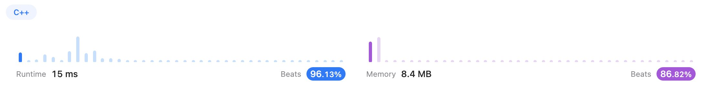
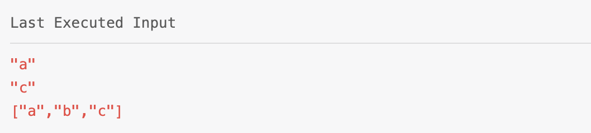
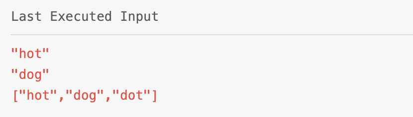
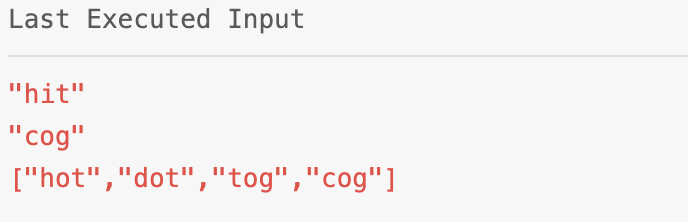
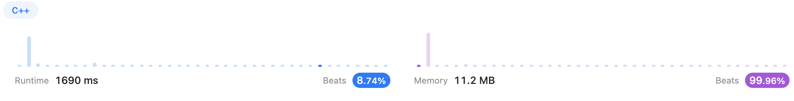

# BFS

## Content

* [1091. Shortest Path in Binary Matrix (Medium)](#1091)
* [279. Perfect Squares (Medium)](#279)
* [127. Word Ladder (Hard)](#127)


---

## <span id="1091">[1091. Shortest Path in Binary Matrix (Medium)](https://leetcode.com/problems/shortest-path-in-binary-matrix/)</span>

### Solution 1 (✅)

[xiaoman_mandy](https://leetcode.com/xiaoman_mandy/)'s [solution](https://leetcode.com/problems/shortest-path-in-binary-matrix/solutions/312814/simple-bfs-c/).

At first, get rid of the edge conditions.

Then, use the `cell` to store every start points of each iteration.

And use `directions` to try the 8 directions of each start point.

Since we use BFS, which iterates layer by layer, the first one that reaches the end point is in the shortest path.

```c++
class Solution {
public:
    int shortestPathBinaryMatrix(vector<vector<int>>& grid) {
        int N = grid.size();
        if(grid[0][0] || grid[N-1][N-1])
            return -1;
        if(N == 1)
            return 1;

        queue<pair<int,int>> cells;
        cells.push(make_pair(0,0));
        vector<vector<int>> directions = {{0, 1}, {1, 1}, {1, 0}, {1, -1}, {0, -1}, {-1, -1}, {-1, 0}, {-1, 1}};
        grid[0][0] = 1;
        while(!cells.empty()){
            auto curr = cells.front();
            cells.pop();
            int row = curr.first, column = curr.second;
            if(row == N-1 && column == N-1)
                return grid[row][column];
            
            for(auto d: directions){
                int next_row = row + d[0], next_column = column + d[1];
                if(next_row >= 0 && next_column >= 0 && next_row < N && next_column < N && grid[next_row][next_column] == 0){
                    cells.push(make_pair(next_row, next_column));
                    grid[next_row][next_column] = grid[row][column] + 1;
                }
            }
            
        }
        return -1;
    }
};
```


---

## <span id="279">[279. Perfect Squares (Medium)](https://leetcode.com/problems/perfect-squares/)</span>

### Solution 1 (✅)

```c++
class Solution {
public:
    int numSquares(int n) {
        int root = sqrt(n);
        if(root * root == n)
            return 1;
        
        int steps = 0;
        vector<bool> visited(n+1, false);
        visited[n] = true;
        queue<int> queue;
        queue.push(n);
        vector<int> perfects;
        for(int i = 1; i <= root; i++)
            perfects.push_back(i*i);
        
        while(!queue.empty()){
            int size = queue.size();
            steps++;
            while(size-- > 0){
                int curr = queue.front();
                queue.pop();
                for(auto sq: perfects){
                    int next = curr - sq;
                    if(next < 0)
                        break;
                    if(next == 0)
                        return steps;
                    if(visited[next])
                        continue;
                    visited[next] = true;
                    queue.push(next);
                }
            }
        }
        return n;
    }
};
```



---

## <span id="127">[127. Word Ladder (Hard)](https://leetcode.com/problems/word-ladder/description/)</span>

### Solution 1 (❌)

I realized at first that this one is quite similar to Problem 279.

So I just imitated.

Basically, here is my idea:

* Find the positions
  * `begin`: `beginWord` in `wordList` ? index : -1
  * `end`: `endWord` in `wordList` ? Index : return
* Initiate a queue called `queue` which is decided by the `begin`
* BFS
  * `sequenceLen` is corresponding to the depth of layers/steps
    * In each layer, find the matching word in the latter part of `wordList` (This is wrong and I will show the reason later)
    * Once it reaches the `endWord`, return the `sequenceLen+1 `(also incorrect)

```c++
class Solution {
public:
    int ladderLength(string beginWord, string endWord, vector<string>& wordList) {
        int begin = -1, end = -1, N = wordList.size();
        //Since words in wordList are unique,
        //Find the position of beginWord and endWord
        for(int i = 0; i < N; i++){
            if(wordList[i] == beginWord)
                begin = i;
            if(wordList[i] == endWord){
                end = i;
                break;
            }
        }
        //The endWord is not in the wordList
        if(end == -1)
            return 0;
        
        //Find the index of the beginning of the sequence
        int len = beginWord.size();
        queue<int> queue;

        //The beginWord is not in the wordList
        //Push the indices of single-letter-different words into the queue
        if(begin == -1){
            for(int i = 0; i < N; i++){
                int diffCnt = 0;
                for(int j = 0; j < len; j++){
                    if(diffCnt > 1)
                        break;
                    if(beginWord[j] != wordList[i][j])
                        diffCnt++;
                }
                if(diffCnt > 1)
                    continue;
                queue.push(i);
            }
        }
        //The beginWord is in the wordList
        //Just push begin into the queue
        else{
            //another edge situations
            if(begin == end)
                return 1;
            if(begin > end)
                return 0;
                
            queue.push(begin);
        }

        //Now we have all the prerequisites
        //Let's use the BFS to find the sequence(if exists)
        int sequenceLen = 0;
        while(!queue.empty()){
            int size = queue.size();
            sequenceLen++;

            //Iterate layer by layer
            while(size-- > 0){
                int curr = queue.front();
                queue.pop();

                //The endWord is found
                if(wordList[curr] == endWord)
                    return sequenceLen+1;

                for(int i = curr+1; i <= end; i++){
                    int diffCnt = 0;
                    for(int j = 0; j < len; j++){
                        if(diffCnt > 1)
                            break;
                        if(wordList[curr][j] != wordList[i][j])
                            diffCnt++;
                    }
                    if(diffCnt > 1)
                        continue;
                    queue.push(i);
                }
            }
        }
        return 0;
    }
};
```

And it failed on this test case.




### Solution 2 (❌)

I thought I might miss the edge situation, so I just added the if statement.

```c++
if(len == 1)
    return 2;
```


```c++
class Solution {
public:
    int ladderLength(string beginWord, string endWord, vector<string>& wordList) {
        int begin = -1, end = -1, N = wordList.size();
        //Since words in wordList are unique,
        //Find the position of beginWord and endWord
        for(int i = 0; i < N; i++){
            if(wordList[i] == beginWord)
                begin = i;
            if(wordList[i] == endWord){
                end = i;
                break;
            }
        }
        //The endWord is not in the wordList
        if(end == -1)
            return 0;
        
        //Find the index of the beginning of the sequence
        int len = beginWord.size();
        queue<int> queue;
        if(len == 1)
            return 2;
        //The beginWord is not in the wordList
        //Push the indices of single-letter-different words into the queue
        if(begin == -1){
            for(int i = 0; i < N; i++){
                int diffCnt = 0;
                for(int j = 0; j < len; j++){
                    if(diffCnt > 1)
                        break;
                    if(beginWord[j] != wordList[i][j])
                        diffCnt++;
                }
                if(diffCnt > 1)
                    continue;
                queue.push(i);
            }
        }
        //The beginWord is in the wordList
        //Just push begin into the queue
        else{
            //another edge situations
            if(begin == end)
                return 1;
            if(begin > end)
                return 0;
                
            queue.push(begin);
        }

        //Now we have all the prerequisites
        //Let's use the BFS to find the sequence(if exists)
        int sequenceLen = 0;
        while(!queue.empty()){
            int size = queue.size();
            sequenceLen++;

            //Iterate layer by layer
            while(size-- > 0){
                int curr = queue.front();
                queue.pop();

                //The endWord is found
                if(wordList[curr] == endWord)
                    return sequenceLen+1;

                for(int i = curr+1; i <= end; i++){
                    int diffCnt = 0;
                    for(int j = 0; j < len; j++){
                        if(diffCnt > 1)
                            break;
                        if(wordList[curr][j] != wordList[i][j])
                            diffCnt++;
                    }
                    if(diffCnt > 1)
                        continue;
                    queue.push(i);
                }
            }
        }
        return 0;
    }
};
```

Another wrong answer.



### Solution 3 (❌)

Then I realized that `s1` could be `wordList[2]` while `s2` might be `wordList[1]`.

It means the matching word should be searched in the whole `wordList` instead of the latter part, which means the `i = curr+1` is not correct.

So I changed the

```c++
for(int i = curr+1; i <= end; i++)
```

into

```c++
for(int i = 0; i < N; i++)
```


Besides, I changed the way I initiate the `sequenceLen` like this:

```c++
if(begin == -1){
  	...
		sequenceLen = 1;
}
else{
		...
		sequenceLen = 0;
}
```

So, when it should return, it will be like this:

```c++
if(wordList[curr] == endWord)
		return sequenceLen;
```


```c++
class Solution {
public:
    int ladderLength(string beginWord, string endWord, vector<string>& wordList) {
        int begin = -1, end = -1, N = wordList.size();
        //Since words in wordList are unique,
        //Find the position of beginWord and endWord
        for(int i = 0; i < N; i++){
            if(wordList[i] == beginWord)
                begin = i;
            if(wordList[i] == endWord)
                end = i;
        }
        //The endWord is not in the wordList
        if(end == -1)
            return 0;
        
        //Find the index of the beginning of the sequence
        int len = beginWord.size();
        queue<int> queue;

        // if(len == 1)
        //     return 2;

        //The beginWord is not in the wordList
        //Push the indices of single-letter-different words into the queue
        int sequenceLen;
        if(begin == -1){
            for(int i = 0; i < N; i++){
                int diffCnt = 0;
                for(int j = 0; j < len; j++){
                    if(diffCnt > 1)
                        break;
                    if(beginWord[j] != wordList[i][j])
                        diffCnt++;
                }
                if(diffCnt == 1)
                    queue.push(i);
            }
            sequenceLen = 1;
        }
        //The beginWord is in the wordList
        //Just push begin into the queue
        else{
            //another edge situation
            if(begin == end)
                return 1;
                
            queue.push(begin);
            sequenceLen = 0;
        }

        //Now we have all the prerequisites
        //Let's use the BFS to find the sequence(if exists)
        while(!queue.empty()){
            int size = queue.size();
            sequenceLen++;

            //Iterate layer by layer
            while(size-- > 0){
                int curr = queue.front();
                queue.pop();

                //The endWord is found
                if(wordList[curr] == endWord)
                    return sequenceLen;

                for(int i = 0; i < N; i++){
                    if(wordList[curr] == wordList[i])
                        continue;
                    int diffCnt = 0;
                    for(int j = 0; j < len; j++){
                        if(diffCnt > 1)
                            break;
                        if(wordList[curr][j] != wordList[i][j])
                            diffCnt++;
                    }
                    if(diffCnt == 1)
                        queue.push(i);
                }
            }
        }
        return 0;
    }
};
```

This time it's not wrong answer but time limit exceeded.



### Solution 4 (✅)

Again, I turned back to find the reason.

And I was aware that there should never be a "loop".

The time limit exceeded error is like this:

```
hit -> hot -> dot -> hot -> dot -> ...
```

So what I needed was to cut this loop off.

How?

This is the answer:

```c++
vector<bool> visited(N, false);
```


Every time we push a index `i` into the `queue`, set `visited[i] = true`:

```c++
if(begin == -1){
		...
    for(int i = 0; i < N; i++){
        if(diffCnt == 1){
            queue.push(i);
            visited[i] = true;
        }
    }
  	...
}
else{
		...    
		queue.push(begin);
		visited[begin] = true;
		sequenceLen = 0;
}

...

while(!queue.empty()){
  	...
		while(size-- > 0){
				...
        for(int i = 0; i < N; i++){
						... 
						if(diffCnt == 1){
								queue.push(i);
								visited[i] = true;
             }
        }
    }
}
```


```c++
class Solution {
public:
    int ladderLength(string beginWord, string endWord, vector<string>& wordList) {
        int begin = -1, end = -1, N = wordList.size();
        //Since words in wordList are unique,
        //Find the position of beginWord and endWord
        for(int i = 0; i < N; i++){
            if(wordList[i] == beginWord)
                begin = i;
            if(wordList[i] == endWord)
                end = i;
        }
        //The endWord is not in the wordList
        if(end == -1)
            return 0;
        
        //Find the index of the beginning of the sequence
        int len = beginWord.size();
        queue<int> queue;
        vector<bool> visited(N, false);

        // if(len == 1)
        //     return 2;

        //The beginWord is not in the wordList
        //Push the indices of single-letter-different words into the queue
        int sequenceLen;
        if(begin == -1){
            for(int i = 0; i < N; i++){
                int diffCnt = 0;
                for(int j = 0; j < len; j++){
                    if(diffCnt > 1)
                        break;
                    if(beginWord[j] != wordList[i][j])
                        diffCnt++;
                }
                if(diffCnt == 1){
                    queue.push(i);
                    visited[i] = true;
                }
            }
            sequenceLen = 1;
        }
        //The beginWord is in the wordList
        //Just push begin into the queue
        else{
            //another edge situation
            if(begin == end)
                return 1;
                
            queue.push(begin);
            visited[begin] = true;
            sequenceLen = 0;
        }

        //Now we have all the prerequisites
        //Let's use the BFS to find the sequence(if exists)
        
        while(!queue.empty()){
            int size = queue.size();
            sequenceLen++;

            //Iterate layer by layer
            while(size-- > 0){
                int curr = queue.front();
                queue.pop();

                //The endWord is found
                if(wordList[curr] == endWord)
                    return sequenceLen;

                for(int i = 0; i < N; i++){
                    if(wordList[curr] == wordList[i] || visited[i])
                        continue;
                    int diffCnt = 0;
                    for(int j = 0; j < len; j++){
                        if(diffCnt > 1)
                            break;
                        if(wordList[curr][j] != wordList[i][j])
                            diffCnt++;
                    }
                    if(diffCnt == 1){
                        queue.push(i);
                        visited[i] = true;
                    }
                }
            }
        }
        return 0;
    }
};
```



---

