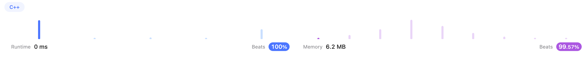

# Backtracking

## Content

* [17. Letter Combinations of a Phone Number (Medium)](#17)
* [93. Restore IP Addresses (Medium)](#93)
* 


---

## <span id="17">[17. Letter Combinations of a Phone Number (Medium)](https://leetcode.com/problems/letter-combinations-of-a-phone-number/)</span>

### Solution 1 (✅)

I had no idea and checked [devanshupatel](https://leetcode.com/devanshupatel/)'s [solution](https://leetcode.com/problems/letter-combinations-of-a-phone-number/solutions/3493347/c-java-python-javascript-backtracking-with-easy-explanation/).

What I learned from it:

* `const vector<string>& ` instead of `vector<string>`: Const reference is a good way to pass the parameter. Because sending it by value would require copying it first, which is not necessary when calling by reference.

```c++
class Solution {
public:
    vector<string> letterCombinations(string digits) {
        vector<string> result;
        if(digits.size() == 0)
            return result;
        vector<string> dial = {"abc", "def", "ghi", "jkl", "mno", "pqrs", "tuv", "wxyz"};
        vector<int> numbers;
        string combination(digits.size(), ' ');
        for(int i = 0; i < digits.size(); i++)
            numbers.push_back(digits[i]-'2');
        backtracking(result, dial, numbers, combination, 0);
        return result;
    }
    void backtracking(vector<string>& result, const vector<string>& dial, const vector<int>& numbers, string& combination, int index) {
        if(index == numbers.size())
            result.push_back(combination);
        else{
            string letters = dial[numbers[index]];
            for(char letter: letters){
                combination[index] = letter;
                backtracking(result, dial, numbers, combination, index+1);
            }
        }
    }
};
```

This solution is perfect! Thank you [devanshupatel](https://leetcode.com/devanshupatel/)



---

## <span id="93">[93. Restore IP Addresses (Medium)](https://leetcode.com/problems/restore-ip-addresses/)</span>

### Solution 1 (✅)

