# Binary Search

## Preface

To calculate the middle index, here are two ways:

* `middle = (left + right) / 2`
* `middle = left + (right - left) / 2`

Since the first way may cause `add overflow`, the second way is safer.

---


## Content

* [69. Sqrt(x) (Easy)](#69)
* [744. Find Smallest Letter Greater Than Target (Easy)](#744)
* [540. Single Element in a Sorted Array (Medium)](#540)
* [278. First Bad Version (Easy)](#278)
* [153. Find Minimum in Rotated Sorted Array (Medium)](#153)
* [34. Find First and Last Position of Element in Sorted Array (Medium)](#34)


---

## <span id="69">[69. Sqrt(x) (Easy)](https://leetcode.com/problems/sqrtx/description/)</span>

### Solution 1 (✅)

I set the right as the input `x`.

To my surprise, this problem made me stuck for many times.

```C++
class Solution {
public:
    int mySqrt(int x) {
        if(x == 0 || x == 1)
            return x;

        int left = 0, right = x, middle = x / 2;
        while(left < right){
            if(x / middle / middle >= 1 && x / (middle+1) / (middle+1) < 1)
                return middle;
            if(x / middle / middle >= 1)
                left = middle + 1;
                middle = left + (right - left) / 2;
            if(x / middle / middle < 1)
                right = middle - 1;
                middle = left + (right - left) / 2;
        }
        return left;
    }
};
```

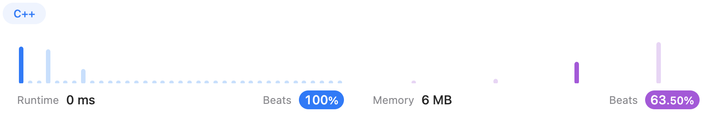

---

## <span id="744">[744. Find Smallest Letter Greater Than Target (Easy)](https://leetcode.com/problems/find-smallest-letter-greater-than-target/)</span>

### Solution 1 (❌)

The key to solving this problem is to search for the `target+1` instead of the `target`.

Here is my code:

```c++
class Solution {
public:
    char nextGreatestLetter(vector<char>& letters, char target) {
        if(target == 'z')
            return letters[0];
        //char greater = target + 1;
        int left = 0, right = letters.size(), middle = right / 2;
        char ans = target + 1;
        while(left < right){
            if(letters[middle] == ans)
                return letters[middle];
            else if(letters[middle] > ans)
                right = middle;
            else
                left = middle + 1;
            middle = left + (right - left) / 2;
        }
        return letters[left];
    }
};
```

But when it comes to this test case:

`letters = ["c","f","j"]`

`target = "a"`

I got `Runtime Error`

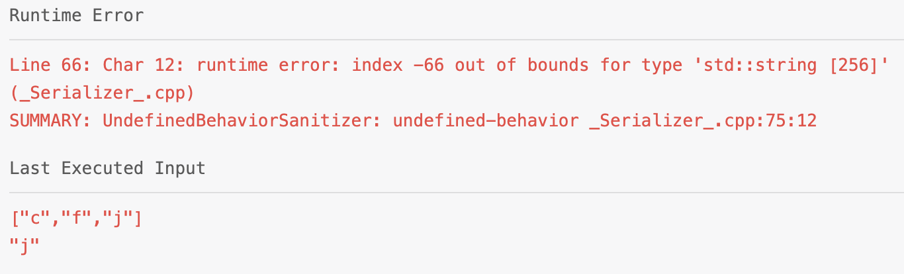

### Solution 2 (✅)

The reason is the first screening condition is not thorough enough.

After changing the first `if` statement, I got this.

```C++
class Solution {
public:
    char nextGreatestLetter(vector<char>& letters, char target) {
        if(target >= letters[letters.size()-1])
            return letters[0];
        //char greater = target + 1;
        int left = 0, right = letters.size(), middle = right / 2;
        char ans = target + 1;
        while(left < right){
            if(letters[middle] == ans)
                return letters[middle];
            else if(letters[middle] > ans)
                right = middle;
            else
                left = middle + 1;
            middle = left + (right - left) / 2;
        }
        return letters[left];
    }
};
```

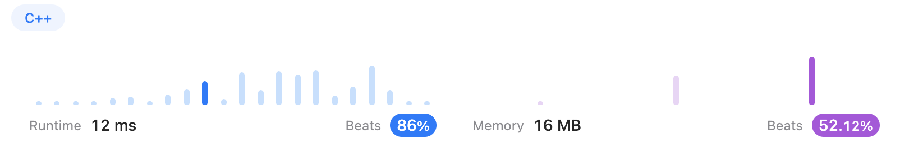


### Solution 3 (✅)

When I was checking others' solutions, I was kinda confident that mine is good enough, until I saw this——[liuchuo](https://leetcode.com/liuchuo/)’s [solution](https://leetcode.com/problems/find-smallest-letter-greater-than-target/solutions/112825/c-2-lines-solution-using-upper-bound/).

Btw, liuchuo is really famous for Chinese ACMers, at least for our team hhhhh. It's so surprised that I saw this name after years but not so surprised that she can give such a good solution, which solved this problem by **<u>ONLY TWO LINES!!!</u>**

```C++
class Solution {
public:
    char nextGreatestLetter(vector<char>& letters, char target) {
        auto it = upper_bound(letters.begin(), letters.end(), target);
        return it == letters.end() ? letters[0] : *it;
    }
};
```

The method `upper_bound()` is the punchline!

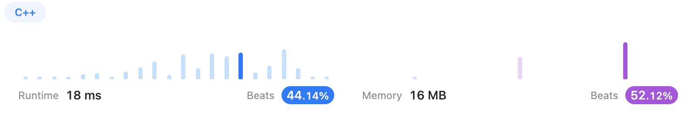


### Solution 4 (✅)

Hold on a second! Under her solution, there is even a shorter solution, which used **<u>ONLY ONE LINE!!!!!!!</u>**

```c++
class Solution {
public:
    char nextGreatestLetter(vector<char>& letters, char target) {
        return letters[(upper_bound(letters.begin(), letters.end(), target) - letters.begin()) % letters.size()];
    }
};
```

The key is `%`.

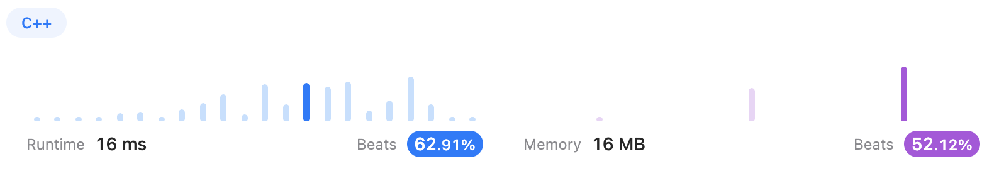

---

## <span id="540">[540. Single Element in a Sorted Array (Medium)](https://leetcode.com/problems/single-element-in-a-sorted-array/)</span>

To find out whether left half or right half we should choose, we can decide with the left element and the right element of `nums[middle]`.

* If `nums[middle] % 2 == 0`
  * If it's equal to its right element `nums[middle] == nums[middle+1]`, we should search in the right half
  * If it's equal to its left element `nums[middle] == nums[middle-1]`, we should search in the left half
* If `nums[middle] % 2 != 0`
  * If it's equal to its left element `nums[middle] == nums[middle-1]`, we should search in the right half
  * If it's equal to its right element `nums[middle] == nums[middle+1]`, we should search in the left half

### Solution 1 (❌)

```C++
class Solution {
public:
    int singleNonDuplicate(vector<int>& nums) {
        int N = nums.size();
        if(N == 1)
            return nums[0];
        int left = 0, right = N - 1, middle = right / 2;
        while(left <= right){
            if(nums[middle] != nums[middle-1] && nums[middle] != nums[middle+1])
                return nums[middle];
            if(middle % 2 == 0){
                if(nums[middle] == nums[middle+1])
                    left = middle + 1;
                else
                    right = middle - 1;
            }
            else{
                if(nums[middle] == nums[middle-1])
                    left = middle + 1;
                else
                    right = middle - 1;
            }
            middle = left + (right - left) / 2;
        }
        return nums[left];
    }
};
```

And I had a `Runtime Error`.

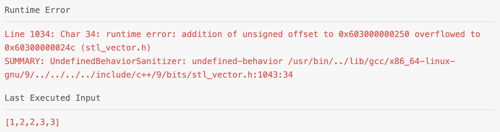

### Solution 2 (✅)

After refining the boundary, I got the correct solution.

```C++
class Solution {
public:
    int singleNonDuplicate(vector<int>& nums) {
        int N = nums.size();
        if(N == 1)
            return nums[0];
        int left = 0, right = N - 1, middle = right / 2;
        while(left <= right){
            if(middle == 0 && nums[middle] != nums[middle+1])
                return nums[middle];
            if(middle == N-1 && nums[middle] != nums[middle-1])
                return nums[middle];
            if(nums[middle] != nums[middle-1] && nums[middle] != nums[middle+1])
                return nums[middle];
            if(middle % 2 == 0){
                if(nums[middle] == nums[middle+1])
                    left = middle + 1;
                else
                    right = middle - 1;
            }
            else{
                if(nums[middle] == nums[middle-1])
                    left = middle + 1;
                else
                    right = middle - 1;
            }
            middle = left + (right - left) / 2;
        }
        return nums[left];
    }
};
```

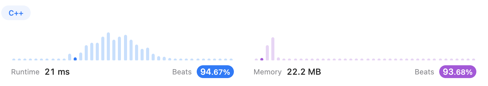

### Solution 3 (✅)

But I didn't think this solution was concise enough. So I read [logan138](https://leetcode.com/logan138/)'s [solution](https://leetcode.com/problems/single-element-in-a-sorted-array/solutions/627921/java-c-python3-easy-explanation-o-logn-o-1/).

We have the same idea. And his solution is way more concise than mine.

Still, the boundary decision is **<u>very important!</u>**

```C++
class Solution {
public:
    int singleNonDuplicate(vector<int>& nums) {
        int left = 0, right = nums.size() - 1;
        while(left < right){
            int mid = left + (right - left) / 2;
            if((mid % 2 == 0 && nums[mid] == nums[mid + 1]) || 
            (mid % 2 == 1 && nums[mid] == nums[mid - 1]))
                left = mid + 1;
            else
                right = mid;
        }
        return nums[left];
    }
};
```

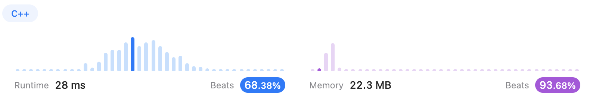

---

## <span id="278">[278. First Bad Version (Easy)](https://leetcode.com/problems/first-bad-version/)</span>

### Solution 1 (✅)

This problem is so simple. But the API stuff is a little interesting.

```C++
// The API isBadVersion is defined for you.
// bool isBadVersion(int version);

class Solution {
public:
    int firstBadVersion(int n) {
        int left = 0, right = n-1, mid = right / 2;
        while(left <= right){
            if(isBadVersion(mid+1))
                right = mid - 1;
            else
                left = mid + 1;
            mid = left + (right - left) / 2;
        }
        return left + 1;
    }
};
```

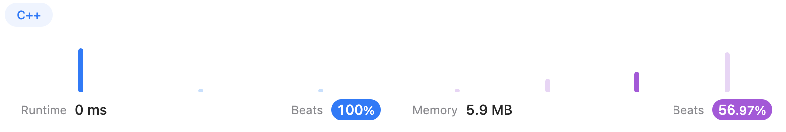

---

## <span id="153">[153. Find Minimum in Rotated Sorted Array (Medium)](https://leetcode.com/problems/find-minimum-in-rotated-sorted-array/)</span>

### Solution 1 (✅)

The main idea is to find the original start. And I achieved it by the two ends of the given vector:

```c++
class Solution {
public:
    int findMin(vector<int>& nums) {
        int left = 0, right = nums.size()-1, mid = right / 2;
        int flag = nums[right] < nums[0] ? nums[right] : nums[0];
        while(left < right){
            if(nums[mid] > flag)
                left = mid + 1;
            else{
                right = mid;
                flag = nums[mid];
            }
            mid = left + (right - left) / 2;
        }
        return nums[left] < flag ? nums[left] : flag;
    }
};
```

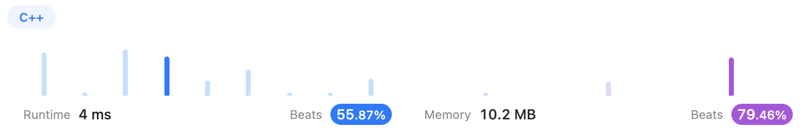

### Solution 2 (✅)

And I read [jianchao-li](https://leetcode.com/jianchao-li/)'s [solution](https://leetcode.com/problems/find-minimum-in-rotated-sorted-array/solutions/48493/compact-and-clean-c-solution/comments/244739), which is a very clear and short one.

```c++
class Solution {
public:
    int findMin(vector<int>& nums) {
        int left = 0, right = nums.size()-1, mid = right / 2;
        while(left < right && nums[left] > nums[right]){
            if(nums[mid] >= nums[left])
                left = mid + 1;
            else
                right = mid;
            mid = left + (right - left) / 2;
        }
        return nums[left];
    }
};
```

And the result is really good.

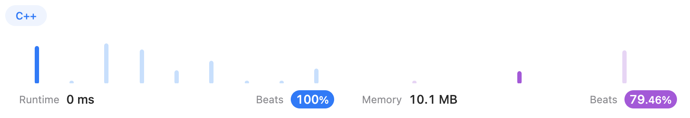

---

## <span id="34">[34. Find First and Last Position of Element in Sorted Array (Medium)](https://leetcode.com/problems/find-first-and-last-position-of-element-in-sorted-array/)</span>

### Solution 1 (❌)

I used 3 while loops, which was so intricate.

* Loop1: find if the target is in the vector and return any one's position
* Loop2: find the lower bound
* Loop3: find the upper bound

However, this solution met many errors. One of them is Runtime error, and I couldn't find out the reason.

```c++
class Solution {
public:
    vector<int> searchRange(vector<int>& nums, int target) {
        vector<int> ans(2, -1);
        int N = nums.size();
        int left = 0, right = N - 1, mid = right / 2;
        while(left < right){
            if(nums[mid] >= target)
                right = mid;
            else
                left = mid + 1;
            mid = left + (right - left) / 2;
        }

        if(nums[left] == target){
            int left1 = 0, right1 = left, mid1 = right1 / 2;
            while(left1 < right1){
                if(nums[mid1] == target)
                    right1 = mid1;
                else
                    left1 = mid1 + 1;
                mid1 = left1 + (right1 - left1) / 2;
            }
            ans[0] = left1;

            int left2 = left, right2 = N - 1, mid2 = left2 + (right2 - left2) / 2;
            while(left2 < right2){
                if(nums[mid2] == target)
                    left2 = mid2;
                else
                    right = mid2 - 1;
                mid2 = left2 + (right2 - left2) / 2;
            }
            ans[1] = right2;
        }
        return ans;
    }
};
```

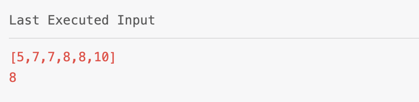

### Solution 2 (❌)

And I looked for others' solutions. But when I tried this, the error still occurred.

```c++
class Solution {
public:
    vector<int> searchRange(vector<int>& nums, int target) {
        vector<int> ans(2, -1);
        int left = 0, right = nums.size()-1, mid = right / 2;
        //To decide if target is in this vector
        while(left < right){
            if(nums[mid] < target)
                left = mid + 1;
            else
                right = mid;
            mid = left + (right - left) / 2;
        }
        //If no, end this method
        if(nums[left] != target)
            return ans;

        //If yes, continue to find the right end
        ans[0] = left;
        left = mid, right = nums.size()-1, mid = left + (right - left) / 2;
        while(left < right){
            if(nums[mid] == target && nums[mid+1] != target){
                left = mid;
                break;
            }
            if(nums[mid] > target)
                right = mid + 1;
            else
                left = mid;
            mid = left + (right - left) / 2;
        }
        ans[1] = left;
        return ans;
    }
};
```

```
Line 1034: Char 9: runtime error: reference binding to null pointer of type 'int' (stl_vector.h)
SUMMARY: UndefinedBehaviorSanitizer: undefined-behavior /usr/bin/../lib/gcc/x86_64-linux-gnu/9/../../../../include/c++/9/bits/stl_vector.h:1043:9
```

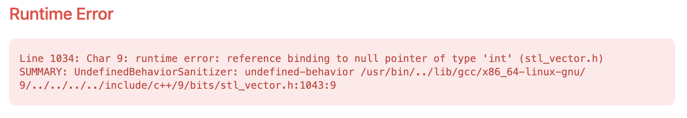

### Solution 3 (❌)

I was **SOOOOO** confused and annoyed.

I was desperate to find out what the heck was that!

And I noticed the one of the constraints:

`0 <= nums.length <= 105`

Then I started guessing: maybe it was because of the 0?

So I add a if statement at the beginning.

```c++
class Solution {
public:
    vector<int> searchRange(vector<int>& nums, int target) {
        vector<int> ans(2, -1);
        if(nums.size() == 0)
            return ans;

        int left = 0, right = nums.size()-1, mid = right / 2;
        //To decide if target is in this vector
        while(left < right){
            if(nums[mid] < target)
                left = mid + 1;
            else
                right = mid;
            mid = left + (right - left) / 2;
        }
        //If no, end this method
        if(nums[left] != target)
            return ans;

        //If yes, continue to find the right end
        ans[0] = left;
        left = mid, right = nums.size()-1, mid = left + (right - left) / 2;
        while(left < right){
            if(nums[mid] == target && nums[mid+1] != target){
                left = mid;
                break;
            }
            if(nums[mid] > target)
                right = mid + 1;
            else
                left = mid;
            mid = left + (right - left) / 2;
        }
        ans[1] = left;
        return ans;
    }
};

```

The Runtime Error didn't show up.

**HOWEVER**, I got another wrong answer.

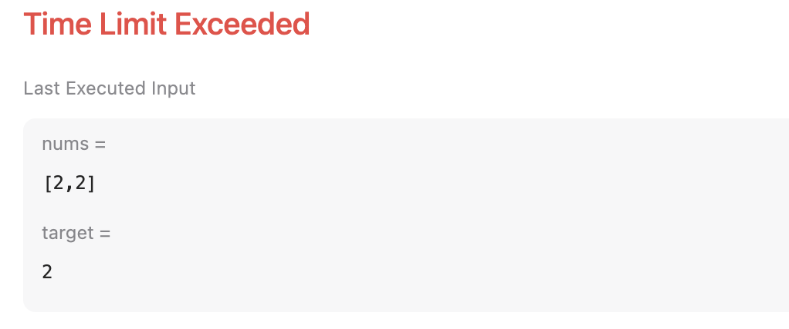

### Solution 4 (✅)

After debugging, I thought the problem was the way to update `left` and `right`.

So, I changed is statements in the second  `While` loop.

```c++
class Solution {
public:
    vector<int> searchRange(vector<int>& nums, int target) {
        vector<int> ans(2, -1);
        if(nums.size() == 0)
            return ans;

        int left = 0, right = nums.size()-1, mid = right / 2;
        //To decide if target is in this vector
        while(left < right){
            if(nums[mid] < target)
                left = mid + 1;
            else
                right = mid;
            mid = left + (right - left) / 2;
        }
        //If no, end this method
        if(nums[left] != target)
            return ans;

        //If yes, continue to find the right end
        ans[0] = left;
        left = mid, right = nums.size()-1, mid = left + (right - left) / 2;
        while(left < right){
            if(nums[mid] == target && nums[mid+1] != target){
                left = mid;
                break;
            }
            if(nums[mid] > target)
                right = mid - 1;
            else
                left = mid + 1;
            mid = left + (right - left) / 2;
        }
        ans[1] = left;
        return ans;
    }
};
```

Finally, I got it accepted......

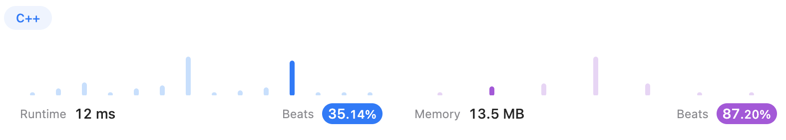

### Solution 5 (✅)

Just for fun, I copied an interesting answer using `lower_bound()`

```c++
class Solution {
public:
    vector<int> searchRange(vector<int>& nums, int target) {
        int startingPosition = lower_bound(nums.begin(), nums.end(), target) - nums.begin();
        int endingPosition = lower_bound(nums.begin(), nums.end(), target+1) - nums.begin() - 1;
        if(startingPosition < nums.size() && nums[startingPosition] == target){
            return {startingPosition, endingPosition};
        }
        return {-1, -1};
    }
};
```

So efficient!

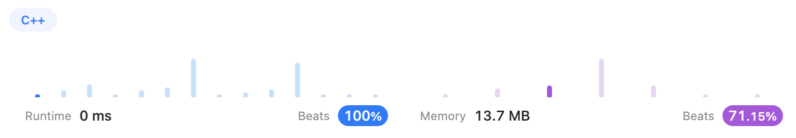
