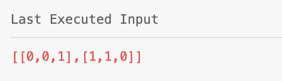
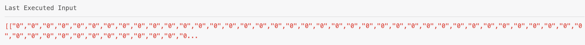
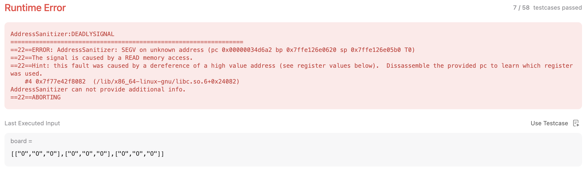

# DFS

## Content

* [695. Max Area of Island (Medium)](#695)
* [200. Number of Islands (Medium)](#200)
* [547. Number of Provinces (Medium)](#547)
* [130. Surrounded Regions (Medium)](#130)
* [417. Pacific Atlantic Water Flow (Medium)](#417)


---

## <span id="695">[695. Max Area of Island (Medium)](https://leetcode.com/problems/max-area-of-island/)</span>

### Solution 1 (❌)

I used DFS to serach the biggest island. And used `visited` to record the visited squares.

```c++
class Solution {
public:
    int maxAreaOfIsland(vector<vector<int>>& grid) {
        int M = grid.size(), N = grid[0].size();
        int maxArea = 0;
        vector<vector<int>> directions = {{0, 1}, {1, 0}, {0, -1}, {-1, 0}};
        vector<bool> visited(M * N, false);
        for(int i = 0; i < M; i++){
            for(int j = 0; j < N; j++){
                maxArea = max(maxArea, DFS(grid, directions, visited, M, N, i, j));
            }
        }
        return maxArea;
    }
    int DFS(vector<vector<int>>& grid, vector<vector<int>> directions, vector<bool>& visited, int M, int N, int row, int column) {
        if(row < 0 || row >= M || column < 0 || column >= N || grid[row][column] == 0 || visited[row * M + column])
            return 0;
        
        visited[row * M + column] = true;
        int area = 1;
        for(auto d : directions)
            area += DFS(grid, directions, visited, M, N, row + d[0], column + d[1]);
        return area;
    }
};
```

But I failed on this test case.




### Solution 2 (✅)

After debugging, I found out that the problem was `visited[row * M + column]`.

And I changed it to `visited[row * N + column]`.

```c++
class Solution {
public:
    int maxAreaOfIsland(vector<vector<int>>& grid) {
        int M = grid.size(), N = grid[0].size();
        int maxArea = 0;
        vector<vector<int>> directions = {{0, 1}, {1, 0}, {0, -1}, {-1, 0}};
        vector<bool> visited(M * N, false);
        for(int i = 0; i < M; i++){
            for(int j = 0; j < N; j++){
                maxArea = max(maxArea, DFS(grid, directions, visited, M, N, i, j));
            }
        }
        return maxArea;
    }
    int DFS(vector<vector<int>>& grid, vector<vector<int>> directions, vector<bool>& visited, int M, int N, int row, int column) {
        if(row < 0 || row >= M || column < 0 || column >= N || grid[row][column] == 0 || visited[row * N + column])
            return 0;
        
        visited[row * N + column] = true;
        int area = 1;
        for(auto d : directions)
            area += DFS(grid, directions, visited, M, N, row + d[0], column + d[1]);
        return area;
    }
};
```

Hmmm... It seems not efficient.


### Solution 3 (✅)

Then I tried [caihao0727mail](https://leetcode.com/caihao0727mail/)'s [solution](https://leetcode.com/problems/max-area-of-island/solutions/108533/java-c-straightforward-dfs-solution/) in my own way.

```c++
class Solution {
public:
    int maxAreaOfIsland(vector<vector<int>>& grid) {
        int max_area = 0, M = grid.size(), N = grid[0].size();
        for(int i = 0; i < M; i++)
            for(int j = 0; j < N; j++)
                if(grid[i][j] == 1)
                    max_area = max(max_area, AreaOfIsland(grid, M, N, i, j));
        return max_area;
    }
    
    int AreaOfIsland(vector<vector<int>>& grid, int M, int N, int row, int column){
        if(row >= 0 && row < M && column >= 0 && column < N && grid[row][column] == 1){
            grid[row][column] = 0;
            return 1 + AreaOfIsland(grid, M, N, row+1, column) + AreaOfIsland(grid, M, N, row-1, column) + AreaOfIsland(grid, M, N, row, column-1) + AreaOfIsland(grid, M, N, row, column+1);
        }
        return 0;
    }
};
```

The reason why this one performs much better is that it does not use `visited`.

Instead, it directly **changes the original data**.

Sure it will be faster. 

But I alwasys have some concerns that changing original data should be avoided.


---

## <span id="200">[200. Number of Islands (Medium)](https://leetcode.com/problems/number-of-islands/)</span>

### Solution 1 (❌)

This one is similar to last one. But I thought it's easier.

However, I still got wrong answer.

```c++
class Solution {
public:
    int numIslands(vector<vector<char>>& grid) {
        int islands = 0, M = grid.size(), N = grid[0].size();
        vector<bool> visited(M * N, false);
        vector<vector<int>> directions = {{0, 1}, {0, -1}, {1, 0}, {-1, 0}};
        for(int i = 0; i < M; i++){
            for(int j = 0; j < N; j++){
                if(grid[i][j] == '1' && !visited[i * N + j]){
                    islands++;
                    DFS(grid, visited, directions, M, N, i, j);
                }
            }
        }
        return islands;
    } 
    void DFS(vector<vector<char>> grid, vector<bool>& visited, vector<vector<int>> directions, int M, int N, int row, int column) {
        if(row < 0 || row >= M || column < 0 || column >= N || grid[row][column] == '0' || visited[row * N + column])
            return;
        visited[row * N + column] = true;
        for(auto d : directions)
            DFS(grid, visited, directions, M, N, row+d[0], column+d[1]);
    }
};
```

It failed on a big test case.




### Solution 2 (✅)

So I thought I might have to change the original data to shorten the runtime.

Then I deleted the `visited` and added the `grid[row][column] = '0'`.

```c++
class Solution {
public:
    int numIslands(vector<vector<char>>& grid) {
        int islands = 0, M = grid.size(), N = grid[0].size();
        vector<vector<int>> directions = {{0, 1}, {0, -1}, {1, 0}, {-1, 0}};
        for(int i = 0; i < M; i++){
            for(int j = 0; j < N; j++){
                if(grid[i][j] == '1'){
                    islands++;
                    DFS(grid, directions, M, N, i, j);
                }
            }
        }
        return islands;
    } 
    void DFS(vector<vector<char>>& grid, vector<vector<int>> directions, int M, int N, int row, int column) {
        if(row < 0 || row >= M || column < 0 || column >= N || grid[row][column] == '0')
            return;
        grid[row][column] = '0';
        for(auto d : directions)
            DFS(grid, directions, M, N, row+d[0], column+d[1]);
    }
};
```

The efficiency was quite poor.


### Solution 3 (✅)

From [cryptx_](https://leetcode.com/cryptx_/)'s[solution](https://leetcode.com/problems/number-of-islands/solutions/501000/c-simple-dfs-beats-100-in-memory-detailed-explanantion/), I realized that the `directions` will cost lots of time and memory.

So I replaced it with

```c++
DFS(grid, M, N, row+1, column);
DFS(grid, M, N, row-1, column);
DFS(grid, M, N, row, column+1);
DFS(grid, M, N, row, column-1);
```


```c++
class Solution {
public:
    int numIslands(vector<vector<char>>& grid) {
        int islands = 0, M = grid.size(), N = grid[0].size();
        for(int i = 0; i < M; i++){
            for(int j = 0; j < N; j++){
                if(grid[i][j] == '1'){
                    islands++;
                    DFS(grid, M, N, i, j);
                }
            }
        }
        return islands;
    } 
    void DFS(vector<vector<char>>& grid, int M, int N, int row, int column) {
        if(row < 0 || row >= M || column < 0 || column >= N || grid[row][column] == '0')
            return;
        grid[row][column] = '0';
        DFS(grid, M, N, row+1, column);
        DFS(grid, M, N, row-1, column);
        DFS(grid, M, N, row, column+1);
        DFS(grid, M, N, row, column-1);
    }
};
```


**Guess what!**


**SOOOO EFFICIENT!!!**

---

## <span id="547">[547. Number of Provinces (Medium)](https://leetcode.com/problems/number-of-provinces/)</span>

### Solution 1 (✅)

I watched this [video](https://www.youtube.com/watch?v=S5UUvCTM0V4) and wrote my code.

```c++
class Solution {
public:
    int findCircleNum(vector<vector<int>>& isConnected) {
        int N = isConnected.size(), provinces = 0;
        vector<bool> visited(N, false);
        for(int i = 0; i < N; i++){
            if(visited[i] == false)
                provinces++;
                DFS(isConnected, visited, i, N);
        }
        return provinces;
    }
    void DFS(vector<vector<int>>& isConnected, vector<bool>& visited, int i, int N) {
        visited[i] = true;
        for(int j = 0; j < N; j++){
            if(!visited[j] && isConnected[i][j] == 1){
                DFS(isConnected, visited, j, N);
            }
        }
    }
};
```


---

## <span id="130">[130. Surrounded Regions (Medium)](https://leetcode.com/problems/surrounded-regions/)</span>

### Solution 1 (❌)

The requirement is to find all surrounded 'O's and flip them to 'X's.

I tried to solve this problem reversely. I went to find those not surrounded 'O's and flip the rest 'O's.

```c++
class Solution {
public:
    void solve(vector<vector<char>>& board) {
        int M = board.size(), N = board[0].size();
        if(M <= 2 || N <= 2)
            return;

        // Mark all 'O's that are not surrounded
        vector<bool> visited(M*N, false);
        // Check the left and right edge
        for(int i = 0; i < M; i++){
            if(board[i][0] == 'O')
                dfs(board, visited, i, 0, M, N);
            if(board[i][N-1] == 'O')
                dfs(board, visited, i, N-1, M, N);
        }
        // Check the top and bottom edge
        for(int j = 0; j < N; j++){
            if(board[0][j] == 'O')
                dfs(board, visited, 0, j, M, N);
            if(board[M-1][j] == 'O')
                dfs(board, visited, M-1, j, M, N);
        }

        // Flip the rest 'O's
        for(int i = 1; i < M-1; i++){
            for(int j = 1; j < N-1; j++){
                if(board[i][j] == 'O' && !visited[i*N+j])
                    board[i][j] = 'X';
            }
        }
    }

    void dfs(vector<vector<char>>& board, vector<bool>& visited, int row, int column, int M, int N) {
        if(visited[row*N+column] || row < 0 || row >= M || column < 0 || column >= N || board[row][column] != 'O')
            return;
        visited[row*N+column] = true;
        dfs(board, visited, row-1, column, M, N);
        dfs(board, visited, row+1, column, M, N);
        dfs(board, visited, row, column-1, M, N);
        dfs(board, visited, row, column+1, M, N);
    }
};
```

And I got a Runtime Error.



### Solution 2 (✅)

When I did the debug, it showed `Program got signal SIGSEGV.` on console, which means the location is not allowed to access.

So, I thought there might be some problems with the `dfs()`.

And I added four if statements in the end.

```c++
class Solution {
public:
    void solve(vector<vector<char>>& board) {
        int M = board.size(), N = board[0].size();
        if(M <= 2 || N <= 2)
            return;

        // Mark all 'O's that are not surrounded
        vector<bool> visited(M*N, false);
        // Check the left and right edge
        for(int i = 0; i < M; i++){
            if(board[i][0] == 'O')
                dfs(board, visited, i, 0, M, N);
            if(board[i][N-1] == 'O')
                dfs(board, visited, i, N-1, M, N);
        }
        // Check the top and bottom edge
        for(int j = 0; j < N; j++){
            if(board[0][j] == 'O')
                dfs(board, visited, 0, j, M, N);
            if(board[M-1][j] == 'O')
                dfs(board, visited, M-1, j, M, N);
        }

        // Flip the rest 'O's
        for(int i = 1; i < M-1; i++){
            for(int j = 1; j < N-1; j++){
                if(board[i][j] == 'O' && !visited[i*N+j])
                    board[i][j] = 'X';
            }
        }
    }

    void dfs(vector<vector<char>>& board, vector<bool>& visited, int row, int column, int M, int N) {
        if(visited[row*N+column] || board[row][column] != 'O')
            return;
        visited[row*N+column] = true;
        if(row-1 >= 0)
            dfs(board, visited, row-1, column, M, N);
        if(row+1 < M)
            dfs(board, visited, row+1, column, M, N);
        if(column-1 >= 0)
            dfs(board, visited, row, column-1, M, N);
        if(column+1 < N)
            dfs(board, visited, row, column+1, M, N);
    }
};
```

Gotcha!


---

## <span id="417">[417. Pacific Atlantic Water Flow (Medium)](https://leetcode.com/problems/pacific-atlantic-water-flow/)</span>

### Solution 1 (❌)

