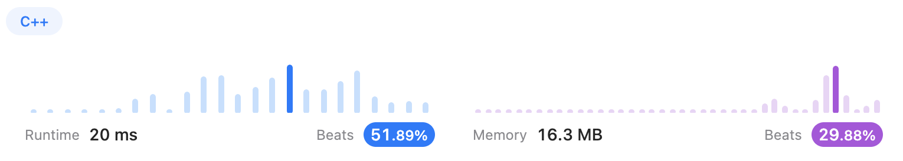

# Divide and Conquer

## Content

* [241. Different Ways to Add Parentheses (Medium)](#241)
* [95. Unique Binary Search Trees II (Medium)](#95)


---

## <span id="241">[241. Different Ways to Add Parentheses (Medium)](https://leetcode.com/problems/different-ways-to-add-parentheses/)</span>

### Solution 1 (✅)

I had no clue. So I searched for an [answer](https://blog.csdn.net/sinat_35261315/article/details/78878615).

And I learned these:

*  **`c_str()` **: For compatibility with C language, since there is no *String* in C. Be sure to use functions such as `strcpy()` to manipulate the pointer returned by `c_str()`.

  ```c++
  //This is wrong
  char* c; 
  string s="1234"; 
  c = s.c_str();
  
  //This is right
  char *cstr,*p;
  string str ("Please split this phrase into tokens");
  cstr = new char [str.size()+1];
  strcpy (cstr, str.c_str());
  ```

  

* **`sscanf()`** 

  ```c++
  sscanf("zhoue3456 ", "%4s", str);      
  printf("str=%s\n", str);	//str="zhou"(substring the first 4 characters)
  
  sscanf("zhou456ahedf", "%[^a ]", str); 
  printf("str=%s\n", str);	//str=zhou456(stop when meets 'a')
  
  sscanf("654321abcdedfABCDEF", "%[1-9a-z]", str); 
  printf("str=%s\n", str);	//str=654321abcded(only numbers and lower-case letters)
  
  sscanf("BCDEF123456abcdedf", "%[^a-z]", str);    
  printf("str=%s\n", str);	//str=BCDEF123456(stop when it meets lower-case letters)
  
  int a,b,c;
  sscanf("2015.04.05", "%d.%d.%d", &a,&b,&c); //remember using '&'
  printf("a=%d,b=%d,c=%d",a,b,c);		//a=2015,b=4,c=5(extract numbers from the string)
  ```

  

```c++
class Solution {
public:
    vector<int> diffWaysToCompute(string expression) {
        int N = expression.size();
        vector<int> ans;
        for(int i = 0; i < N; i++){
            if(isOperator(expression[i])){
                vector<int> left = diffWaysToCompute(expression.substr(0, i));
                vector<int> right = diffWaysToCompute(expression.substr(i+1));
                for(auto num1: left){
                    for(auto num2: right){
                        if(expression[i] == '+')    ans.push_back(num1 + num2);
                        else if(expression[i] == '-')   ans.push_back(num1 - num2);
                        else    ans.push_back(num1 * num2);
                    }
                }
            }
        }
        //if there is no number in ans
        if(ans.empty()){
            int n = 0;
            sscanf(expression.c_str(), "%d", &n);   //read the first number from expression
            ans.push_back(n);   
        }
        return ans;
    }

    bool isOperator(char op){
        return op == '+' || op == '-' || op == '*';
    } 
};
```


### Solution 2 (✅)

[Gcdofree](https://leetcode.com/Gcdofree/)'s [solution](https://leetcode.com/problems/different-ways-to-add-parentheses/solutions/66331/c-4ms-recursive-dp-solution-with-brief-explanation/) is basically the same but using `atoi()`.

```c++
if(result.empty())
    result.push_back(atoi(input.c_str()));
```

Seems better.


---

## <span id="95">[95. Unique Binary Search Trees II (Medium)](https://leetcode.com/problems/unique-binary-search-trees-ii/)</span>

### Solution 1 (✅)

I used [sdkaur](https://leetcode.com/sdkaur/)'s [solution](https://leetcode.com/problems/unique-binary-search-trees-ii/solutions/1849266/c-detailed-explanation-recursive-tree-with-comments/).

```c++
/**
 * Definition for a binary tree node.
 * struct TreeNode {
 *     int val;
 *     TreeNode *left;
 *     TreeNode *right;
 *     TreeNode() : val(0), left(nullptr), right(nullptr) {}
 *     TreeNode(int x) : val(x), left(nullptr), right(nullptr) {}
 *     TreeNode(int x, TreeNode *left, TreeNode *right) : val(x), left(left), right(right) {}
 * };
 */
class Solution {
public:
    vector<TreeNode*> generateTrees(int n) {
       return generateSubTrees(1, n);
    }
    vector<TreeNode*> generateSubTrees(int start, int end) {
        vector<TreeNode*> ans;
        if(start > end){
            ans.push_back(NULL);
            return ans;
        }
        for(int i = start; i <= end; i++){
            vector<TreeNode*> leftST = generateSubTrees(start, i-1);
            vector<TreeNode*> rightST = generateSubTrees(i+1, end);
            for(int j = 0; j < leftST.size(); j++){
                for(int k = 0; k < rightST.size(); k++){
                    TreeNode* root = new TreeNode(i);
                    root->left = leftST[j];
                    root->right = rightST[k];
                    ans.push_back(root);
                }
            }
        }
        return ans;
    }
};
```



---

