# Greedy

## Content

* [455. Assign Cookies (Easy)](#455)
* [435. Non-overlapping Intervals (Medium)](#435)
* [452. Minimum Number of Arrows to Burst Balloons (Medium)](#452)
* [406. Queue Reconstruction by Height (Medium)](#406)
* [121. Best Time to Buy and Sell Stock (Easy)](#121)
* [122. Best Time to Buy and Sell Stock II (Medium)](#122)
* [605. Can Place Flowers (Easy)](#605)
* [392. Is Subsequence (Easy)](#392)
* [665. Non-decreasing Array (Medium)](#665)
* [53. Maximum Subarray (Medium)](#53)
* [763. Partition Labels (Medium)](#763)


---

## <span id="455">[455. Assign Cookies (Easy)](https://leetcode.com/problems/assign-cookies/)</span>

### Solution 1 (✅)

In this problem, my idea is to sort each vector and use two pointers to count how many children can be contented.

```c++
class Solution {
public:
    int findContentChildren(vector<int>& g, vector<int>& s) {
        sort(g.begin(), g.end());
        sort(s.begin(), s.end());
        int contented = 0, sizeg = g.size(), sizes = s.size();
        for(int indexg = 0, indexs = 0; indexg < sizeg && indexs < sizes; ){
            if(s[indexs] >= g[indexg]){
                indexs++;
                indexg++;
                contented++;
            }
            else    indexs++;
        }
        return contented;
    }
};
```


----


## <span id="435">[435. Non-overlapping Intervals (Medium)](https://leetcode.com/problems/non-overlapping-intervals/)</span>

### Solution 1 (✅)

I had no clue so I searched for some solutions. According to [mrityujha](https://leetcode.com/mrityujha/)'s [solution](https://leetcode.com/problems/non-overlapping-intervals/solutions/792726/c-simple-o-nlogn-solution-with-explanation/comments/725788), I sorted the `intervals` by the **start points**.

By the way, through this problem, especially the `cmp()`, I reviewed how C++ functions **pass parameters**. Basically, there are 3 ways: `pass-by-value`, `pass-by-address(*)`, `pass-by-reference(&)(recommended)`

```c++
class Solution {
public:
    static bool cmp(vector<int> &a, vector<int> &b) {
        return a[0] < b[0];
    }
    int eraseOverlapIntervals(vector<vector<int>>& intervals) {
        int N = intervals.size();
        if(N == 0)  return 0;

        sort(intervals.begin(), intervals.end(), cmp);
        int removed = 0, currEnd = intervals[0][1];
        for(int i = 1; i < N; i++){
            if(intervals[i][0] < currEnd){
                removed++;
                currEnd = min(currEnd, intervals[i][1]);
            }
            else    currEnd = intervals[i][1];
        }
        return removed;
    }
};
```


### Solution 2 (✅)

However, many solutions said that the proper way is to sort `intervals` by the **end points**. And the reason is that if we pick the one that ends earlier, we can get more capacity for rest intervals.

```c++
class Solution {
public:
    static bool cmp(vector<int> &a, vector<int> &b) {
        return a[1] < b[1];
    }
    int eraseOverlapIntervals(vector<vector<int>>& intervals) {
        int N = intervals.size();
        if(N == 0)  return 0;

        sort(intervals.begin(), intervals.end(), cmp);
        int removed = 0, currEnd = intervals[0][1];
        for(int i = 1; i < N; i++){
            if(intervals[i][0] < currEnd)   removed++;
            else    currEnd = intervals[i][1];
        }
        return removed;
    }
};
```

They look basically the same.


----

## <span id="452">[452. Minimum Number of Arrows to Burst Balloons (Medium)](https://leetcode.com/problems/minimum-number-of-arrows-to-burst-balloons/)</span>

### Solution 1 (❌)

In my mind, I compressed the `2-D` picture into a `1-D` line, with overlaps (if there are any).

At first, I sorted the `points` by $x_{start}$. Then I planned to find if there was an overlap with the next balloon.

If there was, I updated the left end. (But I made a mistake here: I forgot to update the right end.)

If there wasn't, I reinitialized the left end and right end as well as `arrows++`.

```c++
class Solution {
public:
    static bool cmp(vector<int> &a, vector<int> &b) {
        return a[0] == b[0] ? a[1] < b[1] : a[0] < b[0];
    }
    int findMinArrowShots(vector<vector<int>>& points) {
        sort(points.begin(), points.end(), cmp);
        int balloons = points.size(), arrows = 1, left = points[0][0], right = points[0][1];
        for(int i = 1; i < balloons; i++){
            if(points[i][0] <= right)
                left = points[i][0];
            else{
                left = points[i][0];
                right = points[i][1];
                arrows++;
            }
        }
    return arrows;
    }
};
```


### Solution 2 (✅)

After I updated the right end. It was `AC`.

```c++
class Solution {
public:
    static bool cmp(vector<int> &a, vector<int> &b) {
        return a[0] == b[0] ? a[1] < b[1] : a[0] < b[0];
    }
    int findMinArrowShots(vector<vector<int>>& points) {
        sort(points.begin(), points.end(), cmp);
        int balloons = points.size(), arrows = 1, left = points[0][0], right = points[0][1];
        for(int i = 1; i < balloons; i++){
            if(points[i][0] <= right){
                left = points[i][0];
                if(points[i][1] < right)	//fixed part
                    right = points[i][1];
            }
            else{
                left = points[i][0];
                right = points[i][1];
                arrows++;
            }
        }
    return arrows;
    }
};
```


----

## <span id="406">[406. Queue Reconstruction by Height (Medium)](https://leetcode.com/problems/queue-reconstruction-by-height/)</span>

### Solution 1 (✅)

I racked my brain to find out how to use Greedy to solve this problem. According to the hint, the point is to locate them from the people with the smallest height.

Thanks a lot! However, after I sorted the `people`, what was next?

Again, I racked my brain.

Then I thought: since the `people[i][1]` means how many people in front are equal to or higher than `people[i]`, maybe I should use a variable `skip` to record something. The "something" is the space I should skip.

Because, you know, if `people[i]` is gonna be put in `ans[j]`, the `ans[j]` should at least be empty.

So, I programmed this solution.

```c++
class Solution {
public:
    static bool cmp(vector<int> &a, vector<int> &b) {
        return a[0] == b[0] ? a[1] < b[1] : a[0] < b[0];
    }
    vector<vector<int>> reconstructQueue(vector<vector<int>>& people) {
        int N = people.size();
        vector<vector<int>> ans(N, {-1, -1});
        sort(people.begin(), people.end(), cmp);
        ans[people[0][1]] = people[0];
        for(int i = 1; i < N; i++){
            int skip = people[i][1];
            for(int j = 0; j < N; j++){
                if(skip == 0 && ans[j][0] == -1){
                    ans[j] = people[i];
                    break;
                }
                if(skip != 0 && (ans[j][0] == -1 || ans[j][0] >= people[i][0]))
                    skip--;
            }
        }
        return ans;
    }
};
```

I was kind of uncertain and a little concerned. But, fortunately, it turned out this solution is not bad.


### Solution 2 (✅)

I was just curious if there were any better solutions. And I found [sanjaydwk8](https://leetcode.com/sanjaydwk8/)'s [solution](https://leetcode.com/problems/queue-reconstruction-by-height/solutions/3086123/accepted-easy-solution-short-simple-best-method/). Even though the performance seemed not as great as mine, this solution is much easier to understand.

Differently, this one sorted the `people` from the tallest to the smallest. The smaller persons are "invisible" to the taller ones, and hence one could first arrange the tallest guys as if there was no one else.

After that, all we need is just to `insert` each people instead of doing intricate comparisons and calculations.

```c++
class Solution {
public:
    static bool cmp(vector<int>& a, vector<int>& b) {
        return a[0] == b[0] ? a[1] < b[1] : a[0] > b[0];
    }
    vector<vector<int>> reconstructQueue(vector<vector<int>>& people) {
        int N = people.size();
        sort(people.begin(), people.end(), cmp);
        vector<vector<int>> ans;
        for(int i = 0; i < N; i++)
            ans.insert(ans.begin()+people[i][1], people[i]);
        return ans;
    }
};
```


----

## <span id="121">[121. Best Time to Buy and Sell Stock (Easy)](https://leetcode.com/problems/best-time-to-buy-and-sell-stock/)</span>

### Solution 1 (❌)

I tried to use brute force to solve it, which was to calculate the difference value of each pair.

```c++
class Solution {
public:
    int maxProfit(vector<int>& prices) {
        int N = prices.size();
        priority_queue<int> pq;
        for(int i = 0; i < N; i++){
            for(int j = i+1; j < N; j++){
                pq.push(prices[j]-prices[i]);
            }
        }
        if(pq.top() > 0)    return pq.top();
        return 0;
    }
};
```

And I got a `Runtime error`.

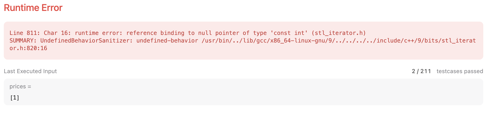

### Solution 2 (❌)

I thought it was just about robustness. So I added an if statement. But it turned out I was too naive.

```c++
class Solution {
public:
    int maxProfit(vector<int>& prices) {
        int N = prices.size();
        if(N <= 1)  return 0;
        
        priority_queue<int> pq;
        for(int i = 0; i < N; i++){
            for(int j = i+1; j < N; j++){
                pq.push(prices[j]-prices[i]);
            }
        }
        if(pq.top() > 0)    return pq.top();
        return 0;
    }
};
```

But it turned out I was too optimistic——what I was worried about happened.

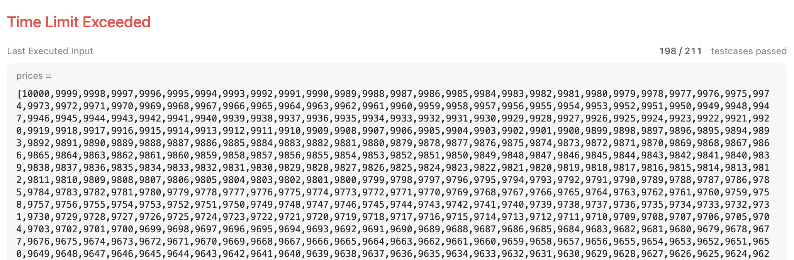

### Solution 3 (❌)

So I reduced the `priority queue` (actually it was kind of useless from the beginning.)

```c++
class Solution {
public:
    int maxProfit(vector<int>& prices) {
        int N = prices.size();
        if(N <= 1)  return 0;

        int maxProfit = 0;
        for(int i = 0; i < N; i++){
            for(int j = i+1; j < N; j++){
                int profit = prices[j]-prices[i];
                if(profit > maxProfit)
                    maxProfit = profit;
            }
        }
        return maxProfit;
    }
};
```

It passed test case 198, but failed to pass test case 199. 

Ok! Fine! I surrendered. Now I'm gonna try some real algorithms.

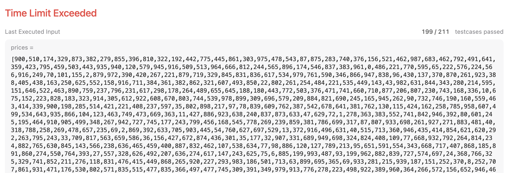

### Solution 4 (✅)

This time, I used two variables `min_price` and `max_profit`. With them, I only had to iterate the `prices` once. Thanks to [zxyperfect](https://leetcode.com/zxyperfect/)'s [solution](https://leetcode.com/problems/best-time-to-buy-and-sell-stock/solutions/39039/sharing-my-simple-and-clear-c-solution/).

```c++
class Solution {
public:
    int maxProfit(vector<int>& prices) {
        int min_price = INT_MAX, max_profit = 0, N = prices.size();
        for(int i = 0; i < N; i++){
            min_price = min(min_price, prices[i]);
            max_profit = max(max_profit, prices[i]-min_price);
        }
        return max_profit;
    }
};
```

Finally, it was `AC`.

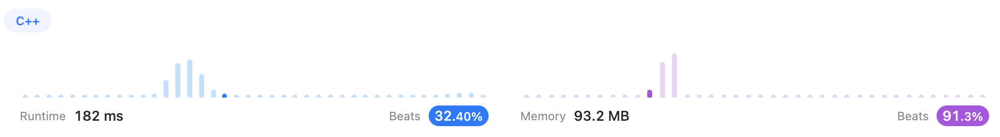

This story tells us never to underestimate any "easy" problems.

----

## <span id="122">[122. Best Time to Buy and Sell Stock II (Medium)](https://leetcode.com/problems/best-time-to-buy-and-sell-stock-ii/)</span>

### Solution 1 (✅)

For me, this one is much easier than the last one.

```c++
class Solution {
public:
    int maxProfit(vector<int>& prices) {
        int N = prices.size(), max_profit = 0;
        for(int i = 1; i < N; i++){
            if(prices[i] > prices[i-1])
                max_profit += prices[i] - prices[i-1];
        }
        return max_profit;
    }
};
```

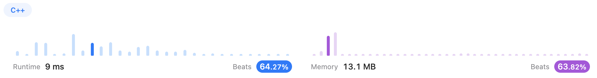

----

## <span id="605">[605. Can Place Flowers (Easy)](https://leetcode.com/problems/can-place-flowers/)</span>

Another easy problem. Hmmm... Let me see...

### Solution 1 (✅)

I thought I was stuck on some points. And I came up with a very complicated and unreadable solution.

```c++
class Solution {
public:
    bool canPlaceFlowers(vector<int>& flowerbed, int n) {
        int N = flowerbed.size(), cnt = 0;
        if(N == 1 && flowerbed[0] == 0) cnt++;
        if(N == 2 && flowerbed[0] == 0 && flowerbed[1] == 0) cnt++;
        if(N >= 3){
            if(flowerbed[0] == 0 && flowerbed[1] == 0){
                cnt++;
                flowerbed[0] = 1;
            }
            for(int i = 1; i < N-1; i++){
                if(flowerbed[i-1] == 0 && flowerbed[i] == 0 && flowerbed[i+1] == 0){
                    cnt++;
                    flowerbed[i] = 1;
                    i++;
                }
                if(cnt >= n)    break;
            }
            if(flowerbed[N-1] == 0 && flowerbed[N-2] == 0) {
                cnt++;
                flowerbed[N-1] = 1;
            }
        }
        return cnt >= n;
    }
};
```


### Solution 2 (✅)

After I referred to the [Official Solution](https://leetcode.com/problems/can-place-flowers/solutions/127632/can-place-flowers/), I made some progress.

As you can see, the structure of the solution is much more concise. 

```c++
class Solution {
public:
    bool canPlaceFlowers(vector<int>& flowerbed, int n) {
        int N = flowerbed.size(), cnt = 0;
        for(int i = 0; i < N; i++){
            if(flowerbed[i] == 0){
                bool left_empty = (i == 0) || (flowerbed[i-1] == 0);
                bool right_empty = (i == N-1) || (flowerbed[i+1] == 0);
                if(left_empty && right_empty){
                    cnt++;
                    flowerbed[i] = 1;
                    i++;
                }
            }
            if(cnt >= n)    return true;
        }
        return cnt >= n;
    }
};
```

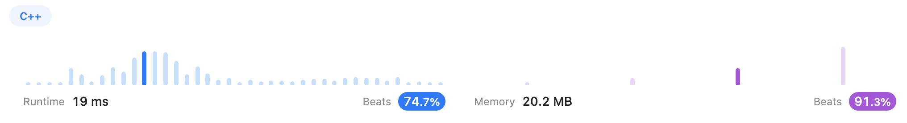

----

## <span id="392">[392. Is Subsequence (Easy)](https://leetcode.com/problems/is-subsequence/)</span>

### Solution 1 (✅)

I felt like it is a `two pointer` problem instead of a typical `greedy` problem. And this time, the easy problem is easy for real.

```c++
class Solution {
public:
    bool isSubsequence(string s, string t) {
        int i = 0, j = 0, sizeS = s.size(), sizeT = t.size();
        while(i < sizeS && j < sizeT){
            if(s[i] == t[j]){
                i++;
                j++;
            }
            else    j++;
        }
        return i == sizeS;
    }
};
```

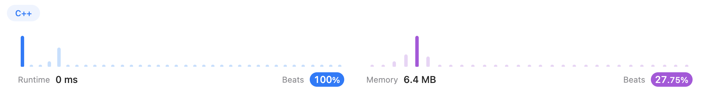

----

## <span id="665">[665. Non-decreasing Array (Medium)](https://leetcode.com/problems/non-decreasing-array/)</span>

### Solution 1 (❌)

As soon as I saw the pictures from [TlTAN](https://leetcode.com/TlTAN/)'s [solution](https://leetcode.com/problems/non-decreasing-array/solutions/2193070/c-simple-code-full-explanation/), I grabbed the key points suddenly.

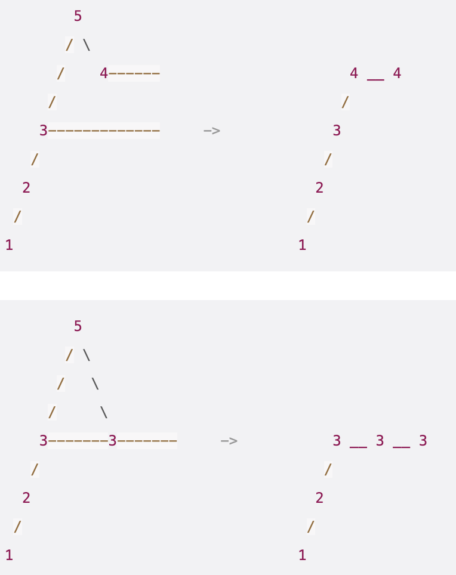

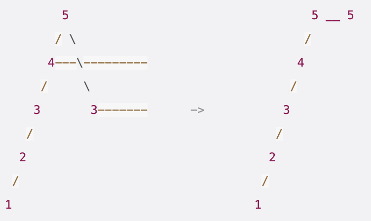

However, I still got a `Runtime error` when the test case was `[1]`.

```c++
class Solution {
public:
    bool checkPossibility(vector<int>& nums) {
        int N = nums.size(), deleted = 0;
        if(nums[0] > nums[1]){
            deleted++;
            nums[0] = nums[1];
        }
        for(int i = 1; i < N-1; i++){
            if(deleted > 1) return false;
            if(nums[i] > nums[i+1]){
                deleted++;
                // delete nums[i]
                if(nums[i-1] <= nums[i+1])
                    nums[i] = nums[i-1];
                // delete nums[i+1]
                else
                    nums[i+1] = nums[i];
            }
        }
        return deleted <= 1;
    }
};
```

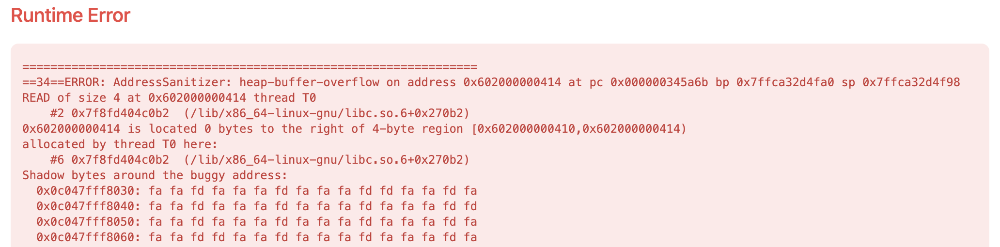

### Solution 2 (✅)

This time, I considered the **<u>robustness</u>**. And got this solution.

```c++
class Solution {
public:
    bool checkPossibility(vector<int>& nums) {
        int N = nums.size(), deleted = 0;
        if(N == 1)  return true;
        
        if(nums[0] > nums[1]){
            deleted++;
            nums[0] = nums[1];
        }
        for(int i = 1; i < N-1; i++){
            if(deleted > 1) return false;
            if(nums[i] > nums[i+1]){
                deleted++;
                // delete nums[i]
                if(nums[i-1] <= nums[i+1])
                    nums[i] = nums[i-1];
                // delete nums[i+1]
                else
                    nums[i+1] = nums[i];
            }
        }
        return deleted <= 1;
    }
};
```


### Solution 3(❌)

I tried to simplify my solution.

```c++
class Solution {
public:
    bool checkPossibility(vector<int>& nums) {
        int N = nums.size(), deleted = 0;
        if(N == 1)  return true;
        
        for(int i = 0; i < N-1; i++){
            if(deleted > 1) return false;
            if(nums[i] > nums[i+1]){
                deleted++;
                // delete nums[i]
                if(nums[i-1] <= nums[i+1] || i == 0)
                    nums[i] = nums[i+1];
                // delete nums[i+1]
                else
                    nums[i+1] = nums[i];
            }
        }
        return deleted <= 1;
    }
};
```

But I got another `Runtime error`. **<u>Can you find out the reason?</u>**

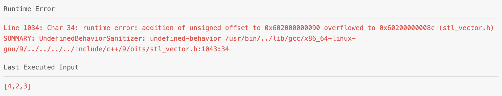


### Solution 4 (✅)

It turned out that in the `if` statement of `// delete nums[i]`, I should check `i == 0` first. Otherwise, `nums[i-1]` could be **out of bounds**.

```c++
class Solution {
public:
    bool checkPossibility(vector<int>& nums) {
        int N = nums.size(), deleted = 0;
        if(N == 1)  return true;
        
        for(int i = 0; i < N-1; i++){
            if(deleted > 1) return false;
            if(nums[i] > nums[i+1]){
                deleted++;
                // delete nums[i]
                if(i == 0 || nums[i-1] <= nums[i+1])
                    nums[i] = nums[i+1];
                // delete nums[i+1]
                else
                    nums[i+1] = nums[i];
            }
        }
        return deleted <= 1;
    }
};
```


At last, I've been asking myself a question all the time——can I give a solution **<u>without changing</u>** the data itself? For now, I have no answer. But I will figure it out!

----

## <span id="53">[53. Maximum Subarray (Medium)](https://leetcode.com/problems/maximum-subarray/)</span>

### Solution 1 (✅)

After 3 weeks without LeetCode practice, it became a little bit harder for me.

I checked [archit91](https://leetcode.com/archit91/)'s [solution](https://leetcode.com/problems/maximum-subarray/solutions/1595195/c-python-7-simple-solutions-w-explanation-brute-force-dp-kadane-divide-conquer/), and solved it by **Divide & Conquer**.

There are 3 parts to consider:

- `[left, mid-1]`
- `[mid+1, right]`
- `[L', R'] = [L', mid-1] + [mid] + [mid+1,R']`, where `L' >= L` and `R' <= R`

```c++
class Solution {
public:
    int maxSubArray(vector<int>& nums) {
        return maxSubArray(nums, 0, nums.size()-1);
    }
    int maxSubArray(vector<int>& nums, int left, int right){
        if(left > right)    return INT_MIN;
        int mid = (left + right) / 2;
        int left_sum = 0, right_sum = 0;
        for(int i = mid-1, temp_sum = 0; i >= left; i--){
            temp_sum += nums[i];
            left_sum = max(left_sum, temp_sum);
        }
        for(int i = mid+1, temp_sum = 0; i <= right; i++){
            temp_sum += nums[i];
            right_sum = max(right_sum, temp_sum);
        }
        return max({maxSubArray(nums, left, mid-1), maxSubArray(nums, mid+1, right), left_sum+nums[mid]+right_sum});
    }
};
```


This solution is not efficient at all!

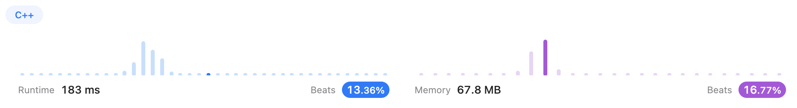


### Solution 2 (✅)

Still, in [archit91](https://leetcode.com/archit91/)'s [solution](https://leetcode.com/problems/maximum-subarray/solutions/1595195/c-python-7-simple-solutions-w-explanation-brute-force-dp-kadane-divide-conquer/), I found a more efficient way, which is ***Dynamic Programming - Tabulation***.

The key point is:

* `dp[0][]` records the current local max subarray sum. Eg: `dp[0][i] = max(nums[i], dp[0][i-1]+nums[i])` means either the current subarray can continue to `nums[i]`, or the current subarray ends and use `nums[i]`as the beginning of a new subarray.
* `dp[1][]` records the global max subarray sum. 

```c++
class Solution {
public:
    int maxSubArray(vector<int>& nums) {
        int N = nums.size();
        vector<vector<int>> dp(2, vector<int>(N));
        dp[0][0] = dp[1][0] = nums[0];
        for(int i = 1; i < N; i++){
            dp[0][i] = max(nums[i], dp[0][i-1]+nums[i]); //local max: [i,...] or [..., i]
            dp[1][i] = max(dp[0][i], dp[1][i-1]);   //global max: local_max or previous_global_max
        }
        return dp[1][N-1];
    }
};
```


This one is a little better.


### Solution 3 (✅)

And I was shocked by a very short solution in [archit91](https://leetcode.com/archit91/)'s [solution](https://leetcode.com/problems/maximum-subarray/solutions/1595195/c-python-7-simple-solutions-w-explanation-brute-force-dp-kadane-divide-conquer/), which is ***Kadane's Algorithm***.

This algorithm uses two integers instead of a two-row vector.

```c++
class Solution {
public:
    int maxSubArray(vector<int>& nums) {
        int local_max = 0, global_max = INT_MIN;
        for(int i: nums){
            local_max = max(i, i+local_max);
            global_max = max(global_max, local_max);
        }
        return global_max;
    }
};
```


Simple and efficient!   : - )

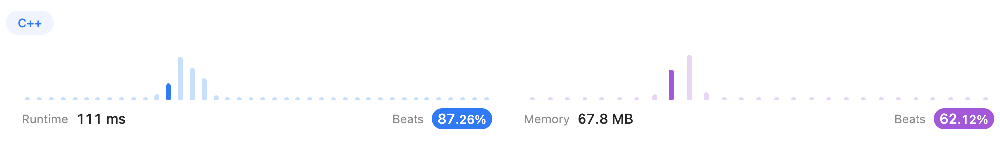

----


## <span id="763">[763. Partition Labels (Medium)](https://leetcode.com/problems/partition-labels/)</span>

### Solution 1 (✅)

My idea is: 

* Traverse the string, and record each letter's first and last appearance places in a vector `appearance`;

* Sort the vector and remove absent letters, which are recorded as `{-1, -1}`, using `erase(it)`;

* Find the substrings

  * The first appearance index of the letter lies in the current substring, which means this substring has not ended;

    * If all of this letter's appearance is in the substring, nothing needs to be changed;
    * If some lie out of the current substring, we need to update the `end_substr` as the `appearance[i].second`;

  * The first appearance index of the letter lies out of the current substring, which means this substring has ended and we need to start a new substring

* DON'T FORGET TO PUSH BACK THE LAST SUBSTRING SIZE! (Ends at the `s.size()-1`)

```c++
class Solution {
public:
    vector<int> partitionLabels(string s) {
        //Record the first and last place of each letter's appearance
        vector<pair<int,int>> appearance;
        for(int i = 0; i < 26; i++)
            appearance.push_back(make_pair(-1,-1));

        int N = s.size();
        for(int i = 0; i < N; i++){
            int letter = s[i] - 'a';
            if(appearance[letter].first == -1){
                appearance[letter].first = i;
                appearance[letter].second = i;
            }
            else
                appearance[letter].second = i;
        }


        //Sort by the first appearance place
        sort(appearance.begin(), appearance.end(), cmp);

        //Remove absent letters
        for(auto it = appearance.begin(); it != appearance.end();){
            if((*it).first != -1)
                break;
            it = appearance.erase(it);
        }

        //Find out substrings
        vector<int> ans;
        vector<int> end_substr;
        end_substr.push_back(-1);
        end_substr.push_back(appearance[0].second);
        for(int i = 0; i < appearance.size(); i++){
            if(appearance[i].first == -1)
                continue;
            //The first appearance of this letter lies in current substring
            //which means current substring has not ended 
            if(end_substr.back() >= appearance[i].first){   
                //if this letter is contained in the substring
                //then nothing happens

                //if this letter only overlaps with the substring
                //then move the end of the substring
                if(appearance[i].second > end_substr.back())
                    end_substr.back() = appearance[i].second;
            }
            //The substring has ended and start a new substring
            else{
                ans.push_back(end_substr.back() - end_substr[end_substr.size()-2]);
                end_substr.push_back(appearance[i].second);
            }
        }
        ans.push_back(N-1 - end_substr[end_substr.size()-2]);
        return ans;
    }

    static bool cmp(pair<int,int> a, pair<int,int> b){
        return a < b;
    }
};
```


### Solution 2 (✅)

After reading the [hi-malik](https://leetcode.com/hi-malik/)'s [solution](https://leetcode.com/problems/partition-labels/solutions/1868842/java-c-visually-explaineddddd/), I realized that there is no need to record the first appearance positions.

Actually, if use a `unordered_map` to record, the order of the map corresponds to the order of the letters appearing in the string.

```c++
class Solution {
public:
    vector<int> partitionLabels(string s) {
        unordered_map<char,int> appearance;
        int N = s.size();
        // filling impact of character's
        for(int i = 0; i < N; i++){
            char ch = s[i];
            appearance[ch] = i;
        }
        // making of result
        vector<int> ans;
        int prev_end = -1;
        int end_substr = 0;
        
        for(int i = 0; i < N; i++){
            end_substr = max(end_substr, appearance[s[i]]);
            if(end_substr == i){
                // partition time
                ans.push_back(end_substr - prev_end);
                prev_end = end_substr;
            }
        }
        return ans;
    }
};
```


---

