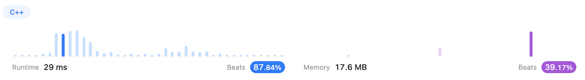
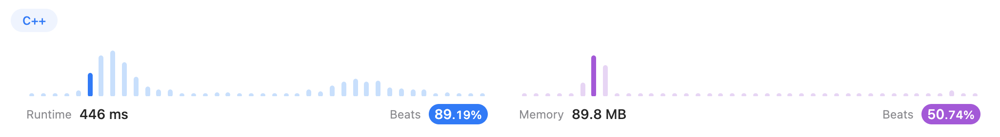
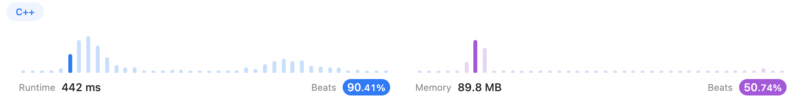
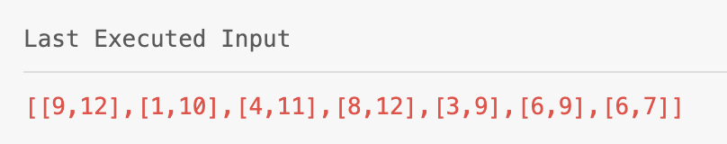
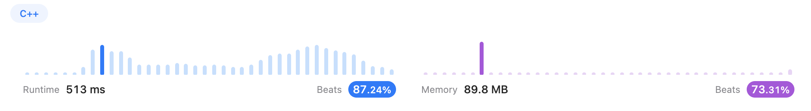
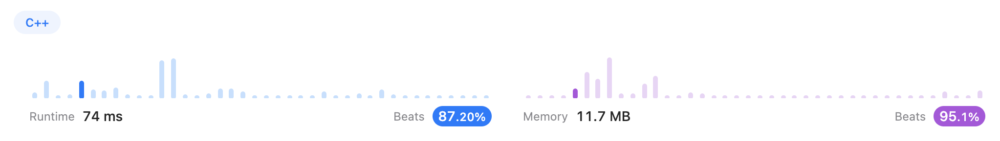
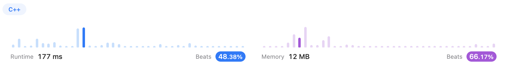

# Greedy

## [455. Assign Cookies (Easy)](https://leetcode.com/problems/assign-cookies/)

### Solution 1 (✅)

In this problem, my idea is to sort each vector and use two pointers to count how many children can be contented.

```c++
class Solution {
public:
    int findContentChildren(vector<int>& g, vector<int>& s) {
        sort(g.begin(), g.end());
        sort(s.begin(), s.end());
        int contented = 0, sizeg = g.size(), sizes = s.size();
        for(int indexg = 0, indexs = 0; indexg < sizeg && indexs < sizes; ){
            if(s[indexs] >= g[indexg]){
                indexs++;
                indexg++;
                contented++;
            }
            else    indexs++;
        }
        return contented;
    }
};
```



----


## [435. Non-overlapping Intervals (Medium)](https://leetcode.com/problems/non-overlapping-intervals/)

### Solution 1 (✅)

I had no clue so I searched some solutions. According to [mrityujha](https://leetcode.com/mrityujha/)'s [solution](https://leetcode.com/problems/non-overlapping-intervals/solutions/792726/c-simple-o-nlogn-solution-with-explanation/comments/725788), I sorted the `intervals` by the **start points**.

By the way, through this problem, especially the `cmp()`, I reviewed how C++ functions **pass parameters**. Basically, there are 3 ways: `pass-by-value`, `pass-by-address(*)`, `pass-by-reference(&)(recommended)`

```c++
class Solution {
public:
    static bool cmp(vector<int> &a, vector<int> &b) {
        return a[0] < b[0];
    }
    int eraseOverlapIntervals(vector<vector<int>>& intervals) {
        int N = intervals.size();
        if(N == 0)  return 0;

        sort(intervals.begin(), intervals.end(), cmp);
        int removed = 0, currEnd = intervals[0][1];
        for(int i = 1; i < N; i++){
            if(intervals[i][0] < currEnd){
                removed++;
                currEnd = min(currEnd, intervals[i][1]);
            }
            else    currEnd = intervals[i][1];
        }
        return removed;
    }
};
```




### Solution 2 (✅)

However, many solutions said that the proper way is to sort `intervals` by the **end points**. And the reason is that if we pick the one ends earlier, we can get more capacity for rest intervals.

```c++
class Solution {
public:
    static bool cmp(vector<int> &a, vector<int> &b) {
        return a[1] < b[1];
    }
    int eraseOverlapIntervals(vector<vector<int>>& intervals) {
        int N = intervals.size();
        if(N == 0)  return 0;

        sort(intervals.begin(), intervals.end(), cmp);
        int removed = 0, currEnd = intervals[0][1];
        for(int i = 1; i < N; i++){
            if(intervals[i][0] < currEnd)   removed++;
            else    currEnd = intervals[i][1];
        }
        return removed;
    }
};
```

They look basically the same.



----

## [452. Minimum Number of Arrows to Burst Balloons (Medium)](https://leetcode.com/problems/minimum-number-of-arrows-to-burst-balloons/)

### Solution 1 (❌)

In my mind, I compressed the `2-D` picture into a `1-D` line, with overlaps (if there are any).

At first, I sorted the `points` by $x_{start}$. Then I planned to find if there was an overlap with the next balloon.

If there was, I updated the left end. (But I made a mistake here: I forgot to update the right end.)

If there wasn't, I reinitialized the left end and right end as well as `arrows++`.

```c++
class Solution {
public:
    static bool cmp(vector<int> &a, vector<int> &b) {
        return a[0] == b[0] ? a[1] < b[1] : a[0] < b[0];
    }
    int findMinArrowShots(vector<vector<int>>& points) {
        sort(points.begin(), points.end(), cmp);
        int balloons = points.size(), arrows = 1, left = points[0][0], right = points[0][1];
        for(int i = 1; i < balloons; i++){
            if(points[i][0] <= right)
                left = points[i][0];
            else{
                left = points[i][0];
                right = points[i][1];
                arrows++;
            }
        }
    return arrows;
    }
};
```




### Solution 2 (✅)

After I updated the right end. It was `AC`.

```c++
class Solution {
public:
    static bool cmp(vector<int> &a, vector<int> &b) {
        return a[0] == b[0] ? a[1] < b[1] : a[0] < b[0];
    }
    int findMinArrowShots(vector<vector<int>>& points) {
        sort(points.begin(), points.end(), cmp);
        int balloons = points.size(), arrows = 1, left = points[0][0], right = points[0][1];
        for(int i = 1; i < balloons; i++){
            if(points[i][0] <= right){
                left = points[i][0];
                if(points[i][1] < right)	//fixed part
                    right = points[i][1];
            }
            else{
                left = points[i][0];
                right = points[i][1];
                arrows++;
            }
        }
    return arrows;
    }
};
```



----

## [406. Queue Reconstruction by Height (Medium)](https://leetcode.com/problems/queue-reconstruction-by-height/)

### Solution 1 (✅)

I racked my brain to find out how to use Greedy to solve this problem. According to the hint, the point is to locate them from the people with the smallest height.

Thanks a lot! However, after I sorted the `people`, what's next?

Again, I racked my brain.

Then I thought: since the `people[i][1]` means how many people in front are equal to or higher than `people[i]`, maybe I should use a variable `skip` to record something. The "something" is the space I should skip.

Because, you know, if `people[i]` is gonna be put in `ans[j]`, the `ans[j]` should at least be empty.

So, I programmed this solution.

```c++
class Solution {
public:
    static bool cmp(vector<int> &a, vector<int> &b) {
        return a[0] == b[0] ? a[1] < b[1] : a[0] < b[0];
    }
    vector<vector<int>> reconstructQueue(vector<vector<int>>& people) {
        int N = people.size();
        vector<vector<int>> ans(N, {-1, -1});
        sort(people.begin(), people.end(), cmp);
        ans[people[0][1]] = people[0];
        for(int i = 1; i < N; i++){
            int skip = people[i][1];
            for(int j = 0; j < N; j++){
                if(skip == 0 && ans[j][0] == -1){
                    ans[j] = people[i];
                    break;
                }
                if(skip != 0 && (ans[j][0] == -1 || ans[j][0] >= people[i][0]))
                    skip--;
            }
        }
        return ans;
    }
};
```

I was kind of uncertain and a little concerned. But, fortunately, it turned out this solution is not bad.




### Solution 2 (✅)

I was just curious if there were any better solutions. And I found [sanjaydwk8](https://leetcode.com/sanjaydwk8/)'s [solution](https://leetcode.com/problems/queue-reconstruction-by-height/solutions/3086123/accepted-easy-solution-short-simple-best-method/). Even though the performance seemed not as great as mine, this solution is much easier to understand.

Differently, this one sorted the `people` from the tallest to the smallest. The smaller persons are "invisible" for the taller ones, and hence one could first arrange the tallest guys as if there was no one else.

After that, all we need is just to `insert` each people instead of doing intricate comparisons and calculation.

```c++
class Solution {
public:
    static bool cmp(vector<int>& a, vector<int>& b) {
        return a[0] == b[0] ? a[1] < b[1] : a[0] > b[0];
    }
    vector<vector<int>> reconstructQueue(vector<vector<int>>& people) {
        int N = people.size();
        sort(people.begin(), people.end(), cmp);
        vector<vector<int>> ans;
        for(int i = 0; i < N; i++)
            ans.insert(ans.begin()+people[i][1], people[i]);
        return ans;
    }
};
```



----

## [121. Best Time to Buy and Sell Stock (Easy)](https://leetcode.com/problems/best-time-to-buy-and-sell-stock/)

### Solution 1 (✅)