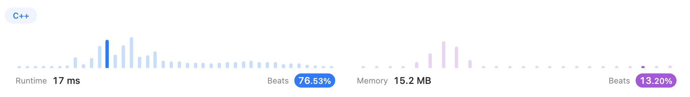
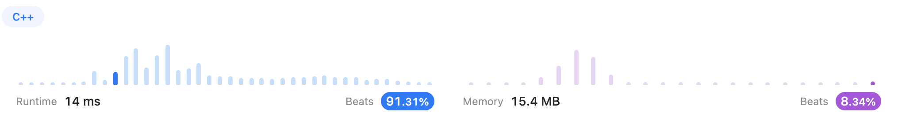
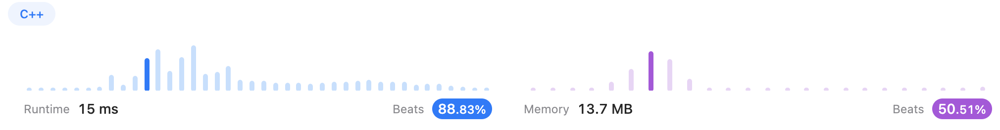
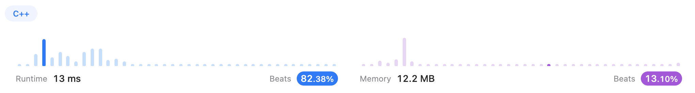
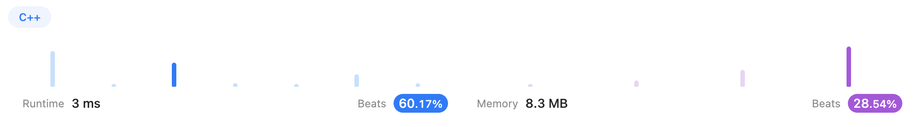
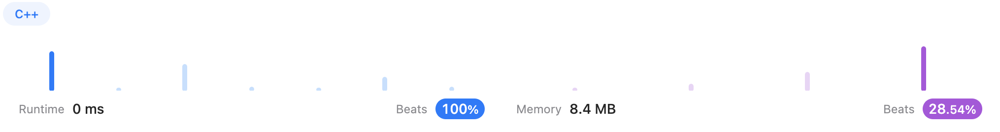

# Sorting

## [215. Kth Largest Element in an Array (Medium)](https://leetcode.com/problems/kth-largest-element-in-an-array/)

### Solution 1 (✅)

Just kidding hhhhh...

```c++
class Solution {
public:
    int findKthLargest(vector<int>& nums, int k) {
        sort(nums.begin(), nums.end(), greater<int>());
        return nums[k-1];
    }
};
```


### Solution 2 (✅)

With [jianchao-li](https://leetcode.com/jianchao-li/)'s [solutions](https://leetcode.com/problems/kth-largest-element-in-an-array/solutions/60309/c-stl-partition-and-heapsort/), I learned `min-heap sort` built with `priority queue`.

```c++
class Solution {
public:
    int findKthLargest(vector<int>& nums, int k) {
        priority_queue<int, vector<int>, greater<int>> pq;
        for(int num: nums){
            pq.push(num);
            if(pq.size() > k)
                pq.pop();
        }
        return pq.top();
    }
};
```

It can be foreseen that it's not as efficient as sort. But it's not the point.


----

## [347. Top K Frequent Elements (Medium)](https://leetcode.com/problems/top-k-frequent-elements/)

### Solution 1 (✅)

With [k_joshi](https://leetcode.com/k_joshi/)'s [solution](https://leetcode.com/problems/top-k-frequent-elements/solutions/1927997/easy-and-simple-c-code-bucket-sort-o-n-linear-time-complexity/), I used `bucket sort`, which costed a lot of space.

```c++
class Solution {
public:
    vector<int> topKFrequent(vector<int>& nums, int k) {
        int N = nums.size();
        unordered_map<int, int> mp;
        for(int num: nums)
            mp[num]++;
        
        vector<vector<int>> buckets(N+1);
        for(auto m: mp)
            buckets[m.second].push_back(m.first);
        
        vector<int> ans;
        for(int i = N; i > 0; i--){		//attention: it starts with N instead of N-1
            int vecLen = buckets[i].size();
            for(int j = 0; j < vecLen; j++){
                if(ans.size() < k)
                    ans.push_back(buckets[i][j]);
            }
            if(ans.size() == k)
                return ans;
        }
        return ans;
    }
};
```




### Solution 2 (✅)

This is just my experiment. I changed `auto` to `pair` to observe the result. 

```c++
class Solution {
public:
    vector<int> topKFrequent(vector<int>& nums, int k) {
        int N = nums.size();
        unordered_map<int, int> mp;
        for(int num: nums)
            mp[num]++;
        
        vector<vector<int>> buckets(N+1);
        for(pair m: mp)
            buckets[m.second].push_back(m.first);
        
        vector<int> ans;
        for(int i = N; i > 0; i--){
            int vecLen = buckets[i].size();
            for(int j = 0; j < vecLen; j++){
                if(ans.size() < k)
                    ans.push_back(buckets[i][j]);
            }
            if(ans.size() == k)
                return ans;
        }
        return ans;
    }
};
```

It turned out that it got faster.




### Solution 3 (✅)

With [sxycwzwzq](https://leetcode.com/sxycwzwzq/)'s [solution](https://leetcode.com/problems/top-k-frequent-elements/solutions/81624/c-o-n-log-n-k-unordered-map-and-priority-queue-maxheap-solution/), I used `max-heap` to find out the top K elements, which saved lots of space.

```c++
class Solution {
public:
    vector<int> topKFrequent(vector<int>& nums, int k) {
        unordered_map<int, int> mp;
        for(int num: nums)
            mp[num]++;
        
        vector<int> ans;
        priority_queue<pair<int, int>> pq;
        for(auto it = mp.begin(); it != mp.end(); it++){
            pq.push(make_pair(it->second, it->first));
            if(pq.size() > mp.size()-k){
                ans.push_back(pq.top().second);
                pq.pop();
            }
        }
        return ans;
    }
};
```



----


## [451. Sort Characters By Frequency (Medium)](https://leetcode.com/problems/sort-characters-by-frequency/)

### Solution 1 (✅)

Similar to the last problem, I used an `unordered_map` to record frequencies. Then used `priority_queue` to build a `max-heap`. At last, composed the string `ans` by every root node.

And I learned to use `std::string()` to form up a repeated string, so that I didn't have to use loop to form it.

```c++
class Solution {
public:
    string frequencySort(string s) {
        unordered_map<int, int> mp;
        for(char c: s)
            mp[c-'a']++;
        
        priority_queue<pair<int, int>> pq;
        for(pair m: mp)
            pq.push(make_pair(m.second, m.first));
        
        string ans = "";
        while(!pq.empty()){
            char tempch = 'a' + pq.top().second;
            ans = ans + string(pq.top().first, tempch);
            pq.pop();
        }
        return ans;
    }
};
```



----


## [75. Sort Colors (Medium)](https://leetcode.com/problems/sort-colors/)

### Solution 1 (✅)

In this solution, I didn't apply any sorting algorithms. Just simply recorded the frequencies and rewrote the vector `nums`.

```c++
class Solution {
public:
    void sortColors(vector<int>& nums) {
        int zeros = 0, ones = 0, twos = 0;
        for(int num: nums){
            if(num == 0)    zeros++;
            else if(num == 1)   ones++;
            else    twos++;
        }
        int index = 0;
        while(zeros--)  nums[index++] = 0;
        while(ones--)  nums[index++] = 1;
        while(twos--)  nums[index++] = 2;
    }
};
```

As a result, the performance was not good of course.




### Solution 2 (✅)

Then I tried [chiragBavishi](https://leetcode.com/chiragBavishi/)'s [solution](https://leetcode.com/problems/sort-colors/solutions/3040429/c-solution-beat-100/) which beat `100%` on runtime.

The main idea is to set two pointers. One points to the head, and the other points to the end. Then iterate the array and swap with the pointer `low` if `nums[index] == 0` and swap with pointer `high ` if `nums[index] == 2`, what left in the middle will naturally be `1`.

With this algorithm, we only have to iterate the `nums` once.

```c++
class Solution {
public:
    void sortColors(vector<int>& nums) {
        int low=0;
        int high=nums.size()-1;
        int index=0;

        while(index<=high){
            if(nums[index] == 0) {
                nums[index++] = nums[low];
                nums[low++] = 0;
            }
            else if(nums[index] == 2) {
                nums[index] = nums[high];
                nums[high--] = 2;
            }
            else index++;
        }
    }
};
```

Hooray! [chiragBavishi](https://leetcode.com/chiragBavishi/) didn't lie to us. It does beat `100%` on runtime.

