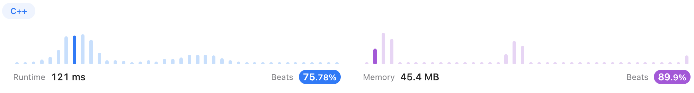
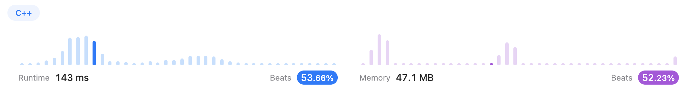

# Sorting

## [215. Kth Largest Element in an Array (Medium)](https://leetcode.com/problems/kth-largest-element-in-an-array/)

### Version 1 (✅)

Just kidding hhhhh...

```c++
class Solution {
public:
    int findKthLargest(vector<int>& nums, int k) {
        sort(nums.begin(), nums.end(), greater<int>());
        return nums[k-1];
    }
};
```




### Version 2 (✅)

With [jianchao-li](https://leetcode.com/jianchao-li/)'s [solutions](https://leetcode.com/problems/kth-largest-element-in-an-array/solutions/60309/c-stl-partition-and-heapsort/), I learned `min-heap sort` built with `priority queue`.

```c++
class Solution {
public:
    int findKthLargest(vector<int>& nums, int k) {
        priority_queue<int, vector<int>, greater<int>> pq;
        for(int num: nums){
            pq.push(num);
            if(pq.size() > k)
                pq.pop();
        }
        return pq.top();
    }
};
```

It can be foreseen that it's not as efficient as sort. But it's not the point.



----

## [347. Top K Frequent Elements (Medium)](https://leetcode.com/problems/top-k-frequent-elements/)

### Version 1

