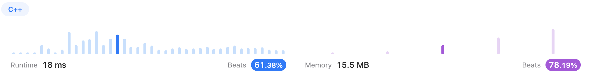
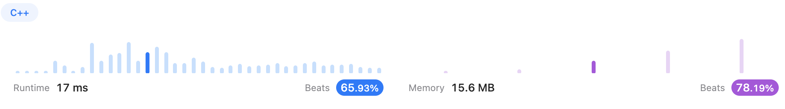
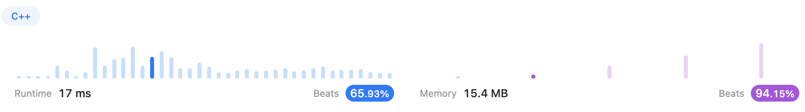
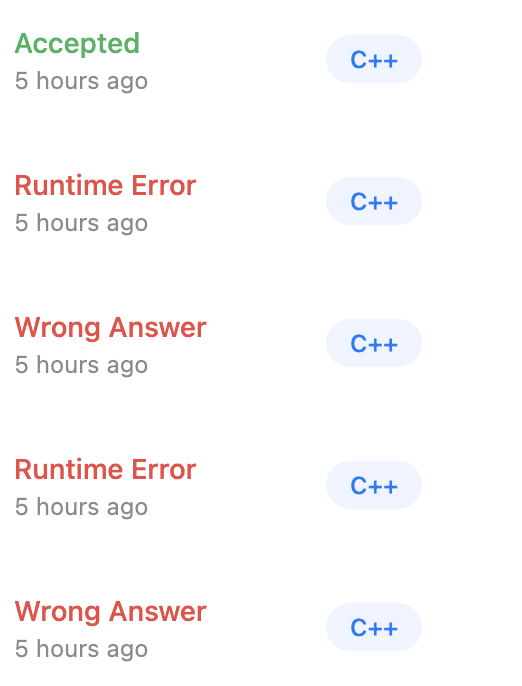
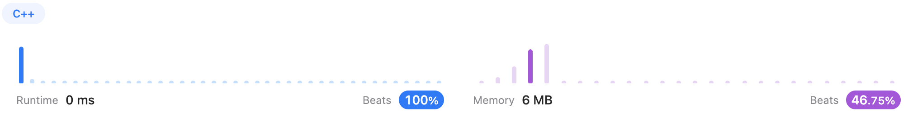
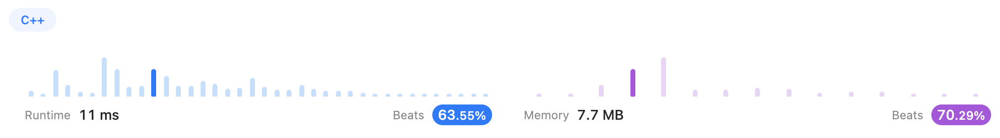
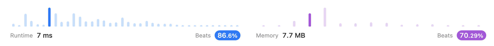
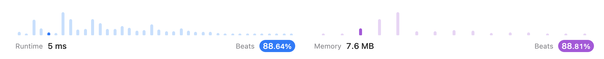
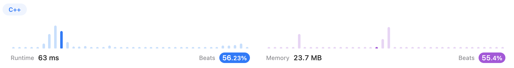
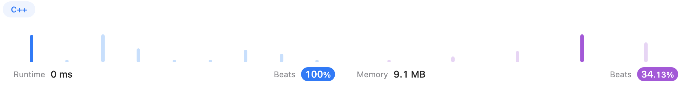

# Two Pointers

## [167. Two Sum II - Input Array Is Sorted (Medium)](https://leetcode.com/problems/two-sum-ii-input-array-is-sorted/description/)

Nothing to say, it's not difficult.

**Time Complexity: O(N)	Traverses all elements only once**

**Space Complexity: O(1)	Only need two additional variables**


### Solution 1 (✅)

```c++
class Solution {
public:
    vector<int> twoSum(vector<int>& numbers, int target) {
        int i = 0, j = numbers.size()-1;
        vector<int> answer;
        while(i < j){
            if(numbers[i] + numbers[j] == target)   break;
            else if(numbers[i] + numbers[j] > target)   j--;
            else    i++;
        }
        answer.push_back(i+1);
        answer.push_back(j+1);
        return answer;
    }
};
```




### Solution 2 (✅)

After checked the [Official Solution](https://leetcode.com/problems/two-sum-ii-input-array-is-sorted/solutions/127822/two-sum-ii-input-array-is-sorted/), I found that I thought about use a variable to represent the sum, so that it doesn't have to do the sum over and over again during the comparison. 

But emmm, I was lazy, I have to admit. 

Anyway, it turns out that this little trick does work, which improved the **runtime**.

```c++
class Solution {
public:
    vector<int> twoSum(vector<int>& numbers, int target) {
        int i = 0, j = numbers.size()-1;
        vector<int> answer;
        while(i < j){
            int sum = numbers[i] + numbers[j];	// I won't be lazy again! ...Will I?
            if(sum == target)   break;
            else if(sum > target)   j--;
            else    i++;
        }
        answer.push_back(i+1);
        answer.push_back(j+1);
        return answer;
    }
};
```




### Solution 3 (✅)

I also found that I could use `{}` to replace the `vector<int> answer ` , which saved some **memory** space and made my program beat <u>94.15%</u>! 	Yeahhh\~~~

And the **<u>robustness</u>** is a great part for me to keep learning!

```c++
class Solution {
public:
    vector<int> twoSum(vector<int>& numbers, int target) {
        int i = 0, j = numbers.size()-1;
        while(i < j){
            int sum = numbers[i] + numbers[j];
            if(sum == target)   return {i+1, j+1};	// replace the vector
            else if(sum > target)   j--;
            else    i++;
        }
        return {-1, -1};	// robustness
    }
};
```




## [633. Sum of Square Numbers (Medium)](https://leetcode.com/problems/sum-of-square-numbers/description/)

It seems easy, right? Just traverse from `0` to `sqrt(target)`.

Then why I got 4 wrong answers! (Don't laugh at me)



### Solution 1 (❌ Wrong Answer)

Let's take a look. (Let me stress it again: DO NOT LAUGH AT ME!)

```c++
class Solution {
public:
    bool judgeSquareSum(int c) {
        int i = 0, j = sqrt(c);
        while (i < j){
            if(i*i + j*j == c)  return true;
            else if(i*i + j*j < c) i++;
            else    j--;
        }
        return false;
    }
};
```

The wrong part is in the `while` sentence. So I got version 2.


### Solution 2 (❌ Runtime Error)

```c++
class Solution {
public:
    bool judgeSquareSum(int c) {
        int i = 0, j = sqrt(c);
        while (i <= j){
            if(i*i + j*j == c)  return true;
            else if(i*i + j*j < c) i++;
            else    j--;
        }
        return false;
    }
};
```

Dang! Why did this happen?

```shell
Line 6: Char 20: runtime error: signed integer overflow: 829921 + 2146654224 cannot be represented in type 'int' (solution.cpp)
SUMMARY: UndefinedBehaviorSanitizer: undefined-behavior prog_joined.cpp:15:20
```

It turns out that the sum is too large to be an `int`. That's fine. And jump over other two wrong answers.


### Solution 3 (✅)

This time, I didn't add them up. Conversely, I subtracted them.

```c++
class Solution {
public:
    bool judgeSquareSum(int c) {
        int i = 0, j = (int)sqrt(c);
        while (i <= j){
            int temp = c - i*i - j*j; // subtraction
            if(temp == 0)  return true;
            else if(temp > 0) i++;
            else    j--;
        }
        return false;
    }
};
```

Finally! 

This is easy, right?




## [345. Reverse Vowels of a String (Easy)](https://leetcode.com/problems/reverse-vowels-of-a-string/)

Initialize two pointers. 

Pointer `i` points to the left end `0` and traversed to the right end. 

Pointer `j` points to the right end `s.size()-1` and traverses to the left end.

**Time Complexity: O(N)	Traverses all elements only once**

**Space Complexity: O(1)	Only need two additional variables**


### Solution 1 (✅)

```c++
class Solution {
public:
    bool isvowel(char c) {
        if(c == 'a' || c == 'e' || c == 'i' || c == 'o' || c == 'u' 
        || c == 'A' || c == 'E' || c == 'I' || c == 'O' || c == 'U')
            return true;
        else    return false;
    }

    string reverseVowels(string s) {
        int i = 0, j = s.size()-1;
        while(i < j){
            if(isvowel(s[i]) && isvowel(s[j])){
                char temp = s[i];
                s[i] = s[j];
                s[j] = temp;
                i++;
                j--;
            }
            else if(!isvowel(s[i])) i++;
            else if(!isvowel(s[j])) j--;
        }
        return s;
    }
};
```




### Solution 2 (✅)

After checked the [Official Solution](https://leetcode.com/problems/reverse-vowels-of-a-string/solutions/2484211/reverse-vowels-of-a-string/?orderBy=most_votes), I simplified my `isvowel()` function. And the **runtime** became shorter.

```c++
class Solution {
public:
    // -----Version 2-----
    bool isvowel(char c) {
        return c == 'a' || c == 'e' || c == 'i' || c == 'o' || c == 'u' 
        || c == 'A' || c == 'E' || c == 'I' || c == 'O' || c == 'U';
    }

    string reverseVowels(string s) {
        int i = 0, j = s.size()-1;
        while(i < j){
            if(isvowel(s[i]) && isvowel(s[j])){
                char temp = s[i];
                s[i] = s[j];
                s[j] = temp;
                i++;
                j--;
            }
            else if(!isvowel(s[i])) i++;
            else if(!isvowel(s[j])) j--;
        }
        return s;
    }
};
```




### Solution 3 (✅)

It seems like there is a `swap` function. I didn't know it hhhhh.

Also, I simplified the code in `if` block.

The **memory** that it used became smaller.

```c++
class Solution {
public:
    bool isvowel(char c) {
        return c == 'a' || c == 'e' || c == 'i' || c == 'o' || c == 'u' 
        || c == 'A' || c == 'E' || c == 'I' || c == 'O' || c == 'U';
    }

    string reverseVowels(string s) {
        int i = 0, j = s.size()-1;
        while(i < j){
            // -----Version 3-----
            if(isvowel(s[i]) && isvowel(s[j]))
                swap(s[i++], s[j--]);
            else if(!isvowel(s[i])) i++;
            else if(!isvowel(s[j])) j--;
        }
        return s;
    }
};
```




## [680. Valid Palindrome II](https://leetcode.com/problems/valid-palindrome-ii/)


### Solution 1 (❌ Runtime Error)

I tried to solve it recursively, but I just painted the lily.

```c++
class Solution {
public:
    int deletable(string s, int deleted) {
        if(deleted > 1)
            return deleted;
        int left = 0, right = s.size()-1;
        while(left <= right){
            if(s[left] == s[right]){
                left++;
                right--;
            }
            else    break;
        }
        deleted++;
        int leftstr = deletable(s.substr(left, right-left), deleted);
        if(leftstr <= 1)    return deleted;
        else    deletable(s.substr(left+1, right-left), deleted);
        return deleted;
    }
    bool validPalindrome(string s) {
        int flag;
        flag = deletable(s, 0);
        if(flag <= 1)    return true;
        else return false;
    }
};
```


### Solution 2 (✅)

However, I led myself into the labyrinth. So, I had to learn from others' solutions, thanks to [kritika_12](https://leetcode.com/kritika_12/)'s [solution](https://leetcode.com/problems/valid-palindrome-ii/solutions/1324407/c-solution-two-pointer-approach/).

And I think it is like reducing a multi-layer recursion to a 2-layer recursion.

```c++
class Solution {
public:
    bool onePardon(int left, int right, string s) {
        while(left <= right){
            if(s[left] == s[right]){
                left++;
                right--;
            }
            else return false;
        }
        return true;
    }
    bool validPalindrome(string s) {
        int left = 0, right = s.size()-1;
        while(left <= right){
            if(s[left] == s[right]){
                left++;
                right--;
            }
            else
                return onePardon(left, right-1, s) || onePardon(left+1, right, s);
        }
        return true;
    }
};
```




## [88. Merge Sorted Array](https://leetcode.com/problems/merge-sorted-array/)

The point is to iterate through the vectors from the tail instead of head.

### Solution 1 (✅)

```c++
class Solution {
public:
    void merge(vector<int>& nums1, int m, vector<int>& nums2, int n) {
        int i = m-1, j = n-1, k = m+n-1;
        while(i >= 0 && j >= 0){
            if(nums1[i] > nums2[j])
                nums1[k--] = nums1[i--];
            else
                nums1[k--] = nums2[j--];
        }
        while(j >= 0)
            nums1[k--] = nums2[j--];
    }
};
```




## [141. Linked List Cycle (Easy)](https://leetcode.com/problems/linked-list-cycle/)


### Solution 1