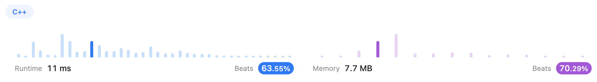
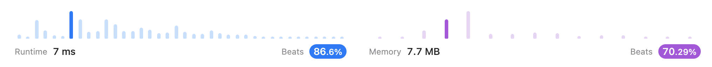
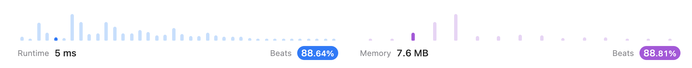

# Two Pointers

## [345. Reverse Vowels of a String (Easy)](https://leetcode.com/problems/reverse-vowels-of-a-string/)

Initialize two pointers. 

Pointer `i` points to the left end `0` and traversed to the right end. 

Pointer `j` points to the right end `s.size()-1` and traverses to the left end.

**Time Complexity: O(N)	Traverses all elements only once**

**Space Complexity: O(1)	Only need two additional variables**


### Version 1

```c++
class Solution {
public:
    bool isvowel(char c) {
        if(c == 'a' || c == 'e' || c == 'i' || c == 'o' || c == 'u' 
        || c == 'A' || c == 'E' || c == 'I' || c == 'O' || c == 'U')
            return true;
        else    return false;
    }

    string reverseVowels(string s) {
        int i = 0, j = s.size()-1;
        while(i < j){
            if(isvowel(s[i]) && isvowel(s[j])){
                char temp = s[i];
                s[i] = s[j];
                s[j] = temp;
                i++;
                j--;
            }
            else if(!isvowel(s[i])) i++;
            else if(!isvowel(s[j])) j--;
        }
        return s;
    }
};
```




### Version 2

After check the [Official Solution](https://leetcode.com/problems/reverse-vowels-of-a-string/solutions/2484211/reverse-vowels-of-a-string/?orderBy=most_votes), I simplified my `isvowel()` function. And the **runtime** became shorter.

```c++
class Solution {
public:
    // -----Version 2-----
    bool isvowel(char c) {
        return c == 'a' || c == 'e' || c == 'i' || c == 'o' || c == 'u' 
        || c == 'A' || c == 'E' || c == 'I' || c == 'O' || c == 'U';
    }

    string reverseVowels(string s) {
        int i = 0, j = s.size()-1;
        while(i < j){
            if(isvowel(s[i]) && isvowel(s[j])){
                char temp = s[i];
                s[i] = s[j];
                s[j] = temp;
                i++;
                j--;
            }
            else if(!isvowel(s[i])) i++;
            else if(!isvowel(s[j])) j--;
        }
        return s;
    }
};
```




### Version 3

It seems like there is a `swap` function. I didn't know it hhhhh.

Also, I simplified the code in `if` block.

The **memory** that it used became smaller.

```c++
class Solution {
public:
    bool isvowel(char c) {
        return c == 'a' || c == 'e' || c == 'i' || c == 'o' || c == 'u' 
        || c == 'A' || c == 'E' || c == 'I' || c == 'O' || c == 'U';
    }

    string reverseVowels(string s) {
        int i = 0, j = s.size()-1;
        while(i < j){
            // -----Version 3-----
            if(isvowel(s[i]) && isvowel(s[j]))
                swap(s[i++], s[j--]);
            else if(!isvowel(s[i])) i++;
            else if(!isvowel(s[j])) j--;
        }
        return s;
    }
};
```

